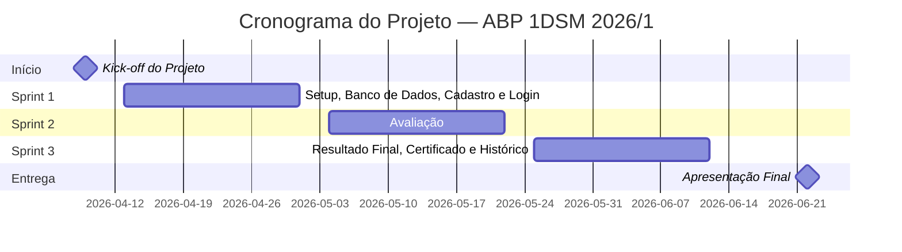

<div align="center">

# 📋 Sistema de Avaliação por Níveis com Certificação

**Projeto ABP — 1º Semestre de Desenvolvimento de Software Multiplataforma · 2026/1**

> 🏫 **Parceiro:** FATEC Jacareí (Interno) · **Contato:** Prof. Antonio Egydio São Thiago Graça · **Focal Point:** Prof. Marcelo Augusto Sudo · **Kick-off:** 09/04/2026

[](https://github.com/DEVassos/scrum-flow-abp)
[](https://github.com/orgs/DEVassos/projects/4)


</div>

---

## 📑 Sumário

- [Sobre o Projeto](#sobre-o-projeto)
  - [Objetivo Geral](#objetivo-geral)
  - [Objetivos Específicos](#objetivos-específicos)
- [Backlog do Produto](#backlog-do-produto-link)
- [Cronograma de Evolução do Projeto](#cronograma-de-evolução-do-projeto)
- [Sprints](#sprints)
- [Tecnologias Utilizadas](#tecnologias-utilizadas)
- [Funcionalidades](#funcionalidades)
- [Arquitetura e Modelo de Dados](#arquitetura-e-modelo-de-dados)
- [Requisitos Funcionais e Não Funcionais](#requisitos-funcionais-e-não-funcionais)
- [Estrutura do Projeto](#estrutura-do-projeto)
- [Como Executar, Usar e Testar o Projeto](#como-executar-usar-e-testar-o-projeto)
- [Rotas da API](#rotas-da-api)
- [Documentação](#documentação)
- [Documentação UML](#documentação-uml)
  - [User Stories](#user-stories)
  - [Diagrama de Casos de Uso](#diagrama-de-casos-de-uso)
  - [Diagrama de Classes](#diagrama-de-classes)
  - [Diagramas de Sequência](#diagramas-de-sequência)
- [Metodologia Ágil — Scrum](#metodologia-ágil--scrum)
  - [Papéis e Responsabilidades](#papéis-e-responsabilidades)
  - [Cerimônias Scrum e Atas](#cerimônias-scrum-e-atas)
  - [Definição de Pronto (DoD)](#definição-de-pronto-dod)
  - [Fluxo de Versionamento](#fluxo-de-versionamento)
- [Referências](#referências)
- [Equipe](#equipe)
- [Licença](#licença)

---

## Sobre o Projeto

Este projeto foi desenvolvido como parte do **Desafio ABP (Aprendizagem Baseada em Projetos)** do 1º Semestre do curso de Desenvolvimento de Software Multiplataforma, edição 2026/1.

O aprendizado de metodologias ágeis é fundamental na formação do desenvolvedor de software — mas sem um mecanismo estruturado de avaliação, é difícil para o estudante saber o que já domina e o que ainda precisa consolidar. Pensando nisso, o desafio propõe a criação de um **portal web de certificação interna em metodologias ágeis**: o usuário se cadastra, realiza avaliações progressivas em **5 níveis de dificuldade** (do básico ao avançado), com questões sorteadas aleatoriamente de um banco de questões, e ao concluir todos os níveis recebe um **certificado digital** baseado no seu desempenho.

Além de resolver o problema do parceiro, o projeto tem objetivo educacional direto: integrar em uma única entrega os conteúdos do semestre — construção de interfaces com **HTML, CSS e JavaScript puro** (sem frameworks), persistência de dados em **PostgreSQL** (DDL e DML) e organização do trabalho com **Scrum** e práticas ágeis básicas.

---

### Objetivo Geral

Desenvolver um **portal web de certificação interna em metodologias ágeis**, com avaliações por níveis de dificuldade e emissão de certificado digital baseado no desempenho, integrando em um único projeto os conteúdos do semestre: HTML, CSS e JavaScript puro, PostgreSQL (DDL e DML) e a metodologia Scrum — ao longo de três sprints durante o 1º semestre de 2026.

---

### Objetivos Específicos

- **Modelar e implementar** o banco de dados relacional (PostgreSQL) com as entidades obrigatórias: usuários, níveis, questões, alternativas, tentativas e resultados
- **Desenvolver o módulo de autenticação** com cadastro por CPF (identificador único) e login seguro, com senha armazenada em hash
- **Organizar o banco de questões em 5 níveis** de dificuldade (do básico ao avançado), cada um com 30 questões distribuídas entre fácil, média e difícil
- **Implementar o mecanismo de avaliação** com sorteio aleatório e balanceado de questões (3 fáceis · 4 médias · 3 difíceis) a partir do banco de cada nível
- **Controlar as tentativas** por usuário e por nível (máximo 2), garantindo que toda a lógica de validação e cálculo de notas resida no back-end
- **Calcular e exibir resultados**: nota final por nível (maior nota entre tentativas) e média final (média das melhores notas de cada nível)
- **Emitir certificado digital** contendo nome, CPF, e-mail, data de emissão e notas discriminadas por nível, disponível após a conclusão de todos os níveis
- **Registrar histórico** de todas as tentativas (data/hora, pontuação e questões sorteadas) para auditoria e acompanhamento pelo usuário
- **Aplicar metodologia Scrum** ao longo do projeto: backlog priorizado, sprints de 2 semanas, cerimônias documentadas, versionamento com Git Flow e critérios de pronto (DoD)

---

## Backlog do Produto (link)

📄 **Acessar o Product Backlog completo →** *(Será adicionado em `docs/scrum/backlog/product-backlog.md`)*

O backlog contém as histórias de usuário priorizadas (US01–US09), critérios de aceite detalhados e histórico de alterações, mantido e atualizado pelo Product Owner a cada sprint.

📊 [**Acessar o Kanban do Projeto (GitHub Projects) →**](https://github.com/orgs/DEVassos/projects/2)

---

## Cronograma de Evolução do Projeto



> Cronograma conforme edital (versão 06/02/2026). **3 sprints** de ~18 dias úteis cada. Apresentação final na semana de 22/06/2026.

---

## Sprints

| Etapa | Período | Documentação | Vídeo do Incremento (YouTube) |
|-------|---------|--------------|-------------------------------|
| **Kick-off** | 09/04/2026 | — | — |
| **Sprint 1** | 13/04 — 30/04/2026 | 📁 Sprint 1 *(A adicionar:* `docs/scrum/sprint-1/sprint-1.md`*)* | A disponibilizar |
| **Sprint 2** | 04/05 — 21/05/2026 | 📁 Sprint 2 *(A adicionar:* `docs/scrum/sprint-2/sprint-2.md`*)* | A disponibilizar |
| **Sprint 3** | 25/05 — 11/06/2026 | 📁 Sprint 3 *(A adicionar:* `docs/scrum/sprint-3/sprint-3.md`*)* | A disponibilizar |
| **Apresentação Final** | Semana de 22/06/2026 | — | A disponibilizar |

---

## Funcionalidades

### Usuário Final

- **Cadastro e autenticação** via CPF (identificador único), nome, e-mail e senha
- **Avaliações por nível** com 10 questões sorteadas aleatoriamente de um banco de 30 por nível
- Distribuição obrigatória por dificuldade: **3 fáceis · 4 médias · 3 difíceis**
- Até **2 tentativas por nível**, com a maior nota sendo considerada
- **Cálculo da média final** com base nas melhores notas de cada nível
- **Geração de certificado** contendo nome, CPF, e-mail, data de emissão e notas por nível
- **Histórico de tentativas** com data/hora, pontuação e questões sorteadas
- **Consulta de progresso** (níveis concluídos, tentativas restantes, melhor nota)

### Administração *(extensão opcional)*

- Cadastro e manutenção de questões, níveis e imagens via área administrativa

---

## Tecnologias Utilizadas

| Camada | Tecnologia |
|--------|-----------|
| Front-end | HTML5 · CSS3 · JavaScript (sem frameworks) |
| Back-end | Node.js |
| Banco de Dados | PostgreSQL |
| Versionamento | Git + GitHub |

> **Restrições técnicas:** o front-end deve ser desenvolvido apenas com HTML, CSS e JavaScript puro, sem uso de frameworks. O banco de dados é exclusivamente PostgreSQL, com DDL e DML explícitos.

---

## Arquitetura e Modelo de Dados

### Tabelas implementadas (Sprint 1)

```
usuarios     — id_usuario (PK · IDENTITY), cpf (UNIQUE), nome, email, senha, certificado_hash
modulos      — id_modulo (PK · IDENTITY), titulo
questoes     — id_questao (PK · IDENTITY), id_modulo (FK), grupo, numero, dificuldade,
               enunciado, alternativa_correta, alternativa_a/b/c/d, imagem
exames       — id_exame (PK · IDENTITY), id_modulo (FK), id_usuario (FK), grupo, tentativa
respostas    — id_resposta (PK · IDENTITY), id_exame (FK), id_questao (FK),
               nota, resposta, respondido_em
```

> ⚠️ **Nota de design:** alternativas estão embutidas em `questoes` (colunas `alternativa_a/b/c/d`), sem tabela separada. As entidades `resultado` por nível e `certificado` **não são tabelas persistidas** — são calculadas dinamicamente via queries sobre `exames` e `respostas`. O certificado é representado pelo campo `certificado_hash` em `usuarios`.


> Documentação de Modelo de Dados: `docs/bd/`


---

## Requisitos Funcionais e Não Funcionais

### Funcionais

| ID | Descrição |
|----|-----------|
| RF01 | Cadastro de usuário com CPF (identificador único), nome, e-mail e senha |
| RF02 | Login exclusivamente por CPF e senha |
| RF03 | Seleção aleatória de 10 questões de um banco de 30 por nível |
| RF04 | Classificação das questões em: fácil, médio e difícil |
| RF05 | Composição obrigatória da avaliação: 3 fáceis, 4 médias e 3 difíceis |
| RF06 | Limite de 2 tentativas por nível |
| RF07 | Nota final do nível = maior nota entre as tentativas |
| RF08 | Resultado final = média das notas finais por nível |
| RF09 | Emissão de certificado com nome, CPF, e-mail, data e média (por nível) |
| RF10 | Histórico de tentativas (data/hora, pontuação, questões sorteadas) |
| RF11 | Consulta de progresso (níveis concluídos, tentativas restantes, melhor nota) |
| RF12 *(opcional)* | Área administrativa para gestão de questões, níveis e imagens |

### Não Funcionais

| ID | Descrição |
|----|-----------|
| RNF01 | Interface simples, clara e responsiva (mobile-friendly) |
| RNF02 | Tempo de resposta adequado para carregamento e registro de respostas |
| RNF03 | Tratamento de dados pessoais em conformidade com a LGPD |
| RNF04 | Prevenção de fraudes: lógica de notas e tentativas no back-end |
| RNF05 | Práticas ágeis: backlog, sprints, versionamento, critérios de pronto (DoD) |
| RNF06 | Documentação mínima: modelo de dados, instruções de execução e rotas |

---

## Estrutura do Projeto (Planejada / Em Construção)

> **Nota:** A estrutura atual abriga o scaffold das documentações no momento de kick-off do projeto. As pastas `frontend/` e `backend/` serão constituídas a partir do início do primeiro ciclo (Sprint 1).

```
scrum-flow-abp/
├── docs/                              # Toda a documentação do projeto
│   ├── README.md                      # Índice geral da documentação
│   ├── edital/                        # Material de referência do desafio ABP
│   │   ├── Desafio 1DSM - 2026-1.pdf  # Enunciado oficial (PDF)
│   │   └── desafio-1dsm-2026-1.md     # Enunciado oficial (Markdown)
│   ├── scrum/                         # Artefatos de gestão ágil (Scrum)
│   │   ├── README.md                  # Índice de navegação Scrum (A criar)
│   │   ├── cronograma.md              # Visão macro e sprint backlogs (A criar)
│   │   ├── backlog/                   # Product Backlog
│   │   ├── templates/                 # Templates de cerimônias e DoR/DoD
│   │   ├── sprint-1/                  # Meta, burndown, DoR/DoD e atas da Sprint 1
│   │   ├── sprint-2/                  # Meta e atas da Sprint 2
│   │   ├── sprint-3/                  # Meta e atas da Sprint 3
│   │   └── riscos-premissas.md        # Riscos, premissas e restrições (A criar)
│   ├── uml/                           # Modelagem e diagramas do sistema
│   │   ├── README.md                  # Índice + rastreabilidade US → UC → RF
│   │   ├── user-stories/              # User Stories (US01–US09)
│   │   ├── casos-de-uso/              # Diagrama de Casos de Uso
│   │   ├── classes/                   # Diagrama de Classes
│   │   └── sequencia/                 # Diagramas de Sequência (3 fluxos)
│   ├── bd/                            # Modelagem do banco de dados
│   │   ├── modelo-conceitual.md       # DER (entidades, atributos, relacionamentos)
│   │   └── modelo-logico.md           # Tabelas, tipos PostgreSQL, PKs, FKs e índices
│   └── manual-usuario/                # Manual do Usuário
│       └── manual-usuario.md
├── .gitignore
├── LICENSE
└── README.md
```

---

## Como Executar e Usar o Projeto

Nesta etapa inicial (Kick-off), o repositório é composto apenas pela base documental, regras de contribuição e cerimônias ágeis. 
A arquitetura de software e as rotinas de execução serão definidas e incluídas a partir da Sprint 1.

```bash
# Clone o repositório para acesso local à documentação
git clone https://github.com/DEVassos/scrum-flow-abp.git
cd scrum-flow-abp
```

---

## Documentação

📂 **[Acessar a Pasta de Documentação completa →](docs/)**

| Documento | Caminho | Descrição |
|-----------|---------|----------|
| 📋 Manual do Usuário | `docs/manual-usuario/manual-usuario.md` *(A ser adicionado)* | Guia de uso da plataforma para o usuário final |
| 📦 Product Backlog | `docs/scrum/backlog/product-backlog.md` *(A ser adicionado)* | Histórias priorizadas com critérios de aceite |
| 📅 Cronograma de Sprints | `docs/scrum/cronograma.md` *(A ser adicionado)* | Planejamento detalhado por sprint |
| 📝 Sprint 1 (Atas e Burndown) | `docs/scrum/sprint-1/sprint-1.md` *(A ser adicionado)* | Meta, backlog, burndown e links para atas |
| ✅ DoR e DoD | `docs/scrum/templates/dor-dod-checklist.md` *(A ser adicionado)* | Checklists de entrada e conclusão de histórias |
| ⚠️ Riscos e Premissas | `docs/scrum/riscos-premissas.md` *(A ser adicionado)* | Registro de riscos, premissas e restrições do projeto |
| 🎯 Casos de Uso | `docs/uml/casos-de-uso/casos-de-uso.md` *(A ser adicionado)* | Diagrama e descrição de UC01–UC16 |
| 🏗️ Diagrama de Classes | `docs/uml/classes/diagrama-de-classes.md` *(A ser adicionado)* | Modelo de dados e regras de negócio |
| 🗂️ Modelo Conceitual (BD) | `docs/bd/modelo-conceitual.md` *(A ser adicionado)* | DER com entidades, atributos e relacionamentos |
| 🗄️ Modelo Lógico (BD) | `docs/bd/modelo-logico.md` *(A ser adicionado)* | Tabelas, tipos PostgreSQL, PKs, FKs e constraints |
| 🔄 Diagramas de Sequência | `docs/uml/sequencia/` | Fluxos de cadastro, avaliação e certificado |
| 📋 User Stories | `docs/uml/user-stories/user-stories.md` *(A ser adicionado)* | Histórias de usuário com critérios de aceite |

---


## Documentação UML

Todos os artefatos de modelagem estão organizados na pasta `docs/uml/` (arquivos serão adicionados ao longo das Sprints), com diagramas em sintaxe **Mermaid** — renderizados nativamente no GitHub.

### User Stories

As histórias de usuário estão documentadas no formato ágil padrão (`Como... Quero... Para...`), com critérios de aceite detalhados por história:

📋 **User Stories:** `docs/uml/user-stories/user-stories.md` *(A ser adicionado)*

### Diagrama de Casos de Uso

Descreve os atores do sistema (Usuário, Administrador e Sistema) e os casos de uso UC01–UC16, com relacionamentos `<<include>>` e descrição textual de cada UC:

🎯 **Diagrama de Casos de Uso:** `docs/uml/casos-de-uso/casos-de-uso.md` *(A ser adicionado)*

### Diagrama de Classes

Modela as entidades do sistema (`Usuario`, `Modulo`, `Questao`, `Exame`, `Resposta`), seus atributos, métodos e relacionamentos. Inclui dicionário de dados e mapeamento de regras de negócio:

🏗️ **Diagrama de Classes:** `docs/uml/classes/diagrama-de-classes.md` *(A ser adicionado)*

### Diagramas de Sequência

| Fluxo | Arquivo |
|-------|---------|
| Cadastro e Login | fluxo-cadastro-login.md *(A adicionar: `docs/uml/sequencia/fluxo-cadastro-login.md`)* |
| Avaliação de Nível | fluxo-avaliacao.md *(A adicionar: `docs/uml/sequencia/fluxo-avaliacao.md`)* |
| Certificado e Progresso | fluxo-certificado-progresso.md *(A adicionar: `docs/uml/sequencia/fluxo-certificado-progresso.md`)* |

---

## Metodologia Ágil — Scrum

O projeto é conduzido com o framework **Scrum**, seguindo seus pilares de transparência, inspeção e adaptação. A adoção do Scrum é um requisito da disciplina (RNF05) e orienta todas as decisões de planejamento, execução e entrega ao longo do semestre.

---

### Papéis e Responsabilidades

| Papel | Responsabilidade |
|-------|------------------|
| **Product Owner (PO)** | Define e prioriza o Backlog do Produto; representa os interesses do cliente; valida as entregas ao final de cada Sprint |
| **Scrum Master (SM)** | Facilita as cerimônias Scrum; remove impedimentos; garante que o time siga os valores e práticas ágeis |
| **Time de Desenvolvimento** | Autogerenciável; responsável por estimar, planejar e implementar os itens do Sprint Backlog |

---

### Cerimônias Scrum e Atas

| Cerimônia | Frequência | Objetivo |
|-----------|------------|----------|
| **Sprint Planning** | Início de cada sprint | Selecionar itens do backlog e planejar as tarefas da sprint |
| **Daily Scrum** | Diária (≤15 min) | Sincronizar o time: o que foi feito, o que será feito, impedimentos |
| **Sprint Review** | Final de cada sprint | Apresentar o incremento entregue e coletar feedback |
| **Sprint Retrospective** | Final de cada sprint | Refletir sobre o processo e definir melhorias para a próxima sprint |
| **Backlog Refinement** | Durante a sprint | Detalhar e estimar histórias futuras do backlog |

As atas de todas as cerimônias são registradas e versionadas no repositório, organizadas por sprint:

| Sprint | Pasta de Atas |
|--------|--------------|
| Sprint 1 | `docs/scrum/sprint-1/atas/` *(A adicionar)* |
| Sprint 2 | `docs/scrum/sprint-2/atas/` *(A adicionar)* |
| Sprint 3 | `docs/scrum/sprint-3/atas/` *(A adicionar)* |

---

### Definição de Pronto (DoD)

Um item do backlog é considerado **Pronto** quando atende a todos os critérios definidos no checklist oficial:

✅ **docs/scrum/templates/dor-dod-checklist.md** *(A ser adicionado)* — checklist completo de DoR (entrada na sprint) e DoD (conclusão de história)

Os registros de DoR e DoD por sprint estão em cada `docs/scrum/sprint-N/dor-dod.md` *(A serem adicionados)*, validados por história de usuário.

---

### Fluxo de Versionamento

O projeto utiliza **Git Flow** adaptado para o contexto acadêmico:

```
main        ← código estável, entregue ao final de cada sprint
  └── develop     ← integração contínua do time
        ├── feature/US01-cadastro-usuario
        ├── feature/US02-login
        ├── feature/US03-avaliacao
        └── fix/correcao-calculo-nota
```

**Regras de contribuição:**

1. Nunca commitar diretamente em `main` ou `develop`
2. Cada história/tarefa deve ter sua própria branch, criada a partir de `develop`
3. Nomes de branch seguem o padrão: `feature/<id>-descricao` ou `fix/<descricao>`
4. O merge para `develop` é feito exclusivamente via **Pull Request**, com ao menos uma aprovação
5. O merge de `develop` para `main` ocorre ao final de cada sprint, após a Sprint Review

📖 **[Guia completo de contribuição → CONTRIBUTING.md](./CONTRIBUTING.md)** — convenção de commits, padrão de branches, fluxo de PR e como registrar dailies.

---

## Referências

> Referências bibliográficas e documentações técnicas utilizadas ao longo do projeto.

1. SCHWABER, K.; SUTHERLAND, J. **The Scrum Guide**: The Definitive Guide to Scrum: The Rules of the Game. 2020. Disponível em: [https://scrumguides.org/](https://scrumguides.org/). Acesso em: abr. 2026.

2. DRIESSEN, V. **A successful Git branching model**. 2010. Disponível em: [https://nvie.com/posts/a-successful-git-branching-model/](https://nvie.com/posts/a-successful-git-branching-model/). Acesso em: abr. 2026.

3. BRASIL. **Lei nº 13.709, de 14 de agosto de 2018** — Lei Geral de Proteção de Dados Pessoais (LGPD). Disponível em: [https://www.planalto.gov.br/ccivil_03/_ato2015-2018/2018/lei/l13709.htm](https://www.planalto.gov.br/ccivil_03/_ato2015-2018/2018/lei/l13709.htm). Acesso em: abr. 2026.

4. POSTGRESQL GLOBAL DEVELOPMENT GROUP. **PostgreSQL 16 Documentation**. Disponível em: [https://www.postgresql.org/docs/](https://www.postgresql.org/docs/). Acesso em: abr. 2026.

5. MERMAID. **Mermaid — Diagramming and charting tool**. Disponível em: [https://mermaid.js.org/](https://mermaid.js.org/). Acesso em: abr. 2026.

6. OBJECT MANAGEMENT GROUP (OMG). **Unified Modeling Language (UML)** — Specification v2.5.1. Disponível em: [https://www.omg.org/spec/UML/](https://www.omg.org/spec/UML/). Acesso em: abr. 2026.

---

## Equipe

<table>
  <thead>
    <tr>
      <th>Foto</th>
      <th>Nome</th>
      <th>Papel</th>
      <th>GitHub</th>
      <th>LinkedIn</th>
    </tr>
  </thead>
  <tbody>
    <tr>
      <td></td>
      <td>Gustavo Koiti</td>
      <td>Product Owner</td>
      <td><a href="https://github.com/gustavokoitiyoshimura">@gustavokoitiyoshimura</a></td>
      <td><a href="https://linkedin.com/in/">LinkedIn</a></td>
    </tr>
    <tr>
      <td></td>
      <td>Gabriel Travensolli</td>
      <td>Scrum Master</td>
      <td><a href="https://github.com/travensolli">@travensolli</a></td>
      <td><a href="https://www.linkedin.com/in/gabrieltravensolli/">LinkedIn</a></td>
    </tr>
    <tr>
      <td></td>
      <td>Andrea Turíbio</td>
      <td>Desenvolvedora</td>
      <td><a href="https://github.com/DeaTuribio">@DeaTuribio</a></td>
      <td><a href="https://www.linkedin.com/in/andrea-turibio-41507467/">LinkedIn</a></td>
    </tr>
    <tr>
      <td></td>
      <td>Henrique Camargo</td>
      <td>Desenvolvedor</td>
      <td><a href="https://github.com/henriqueptbd-cell">@henriqueptbd-cell</a></td>
      <td><a href="https://www.linkedin.com/in/henrique-camargo-6275a6394/">LinkedIn</a></td>
    </tr>
    <tr>
      <td></td>
      <td>Lucas Amorim</td>
      <td>Desenvolvedor</td>
      <td><a href="https://github.com/LUCASAMR23">@LUCASAMR23</a></td>
      <td><a href="https://www.linkedin.com/in/lucas-amorim-4b3312362/">LinkedIn</a></td>
    </tr>
    <tr>
      <td></td>
      <td>Marcello Campbell</td>
      <td>Desenvolvedor</td>
      <td><a href="https://github.com/mparise28-dev">@mparise28-dev</a></td>
      <td><a href="https://www.linkedin.com/in/marcello-parise-campbell-fonseca-147965194/">LinkedIn</a></td>
    </tr>
    <tr>
      <td></td>
      <td>Vinicius Augusto</td>
      <td>Desenvolvedor</td>
      <td><a href="https://github.com/viniciusaugusto1997">@viniciusaugusto1997</a></td>
      <td><a href="https://linkedin.com/in/">LinkedIn</a></td>
    </tr>
  </tbody>
</table>

---

## Licença

Distribuído sob a licença especificada no arquivo [LICENSE](./LICENSE). Consulte o arquivo para mais detalhes.

---

<div align="center">
  Desenvolvido com dedicação pela equipe <strong>DEVassos</strong> · 1DSM 2026/1
</div>


