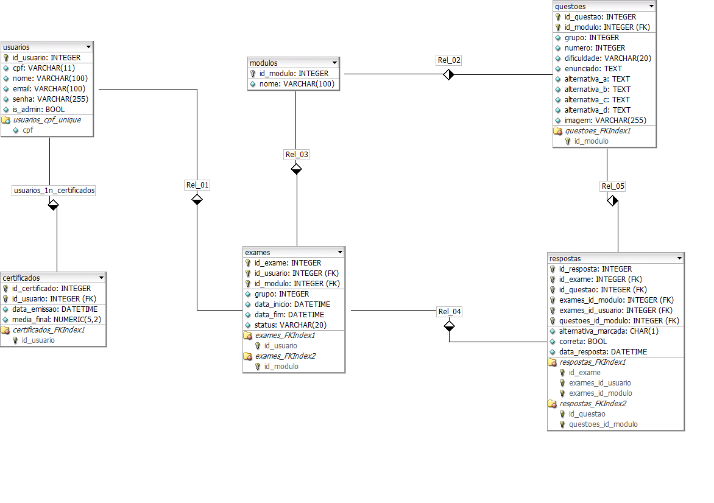

# 🗄️ Modelagem do Banco de Dados

← [Índice da Documentação](../../README.md) · [Modelos](../README.md)

Documentação dos modelos conceitual e lógico do PostgreSQL. Os requisitos referenciados (RF/RP) têm como fonte única o [Edital](../../edital/desafio-1dsm-2026-1.md); veja siglas no [Glossário](../../GLOSSARIO.md).

> 📌 **Restrição ([RP02](../../GLOSSARIO.md)):** apenas DDL e DML explícitos. Nenhum ORM permitido.

> Os modelos abaixo refletem o estado final do projeto (Sprints 1–3): usuários, módulos, questões, exames, respostas e certificados.

---

## Modelo Conceitual (DER)

Entidades, atributos e relacionamentos do domínio.

---

## Modelo Lógico

Tabelas, tipos, PKs, FKs e índices para PostgreSQL.

> Arquivo fonte editável: [modelo_abp.xml](./modelo-logico/modelo_abp.xml) (brModelo/draw.io)

---

## 🏗️ Tabelas Principais

| Tabela | Campos principais | Requisitos atendidos |
|--------|-------------------|----------------------|
| `usuarios` | `id_usuario`, `nome`, `email`, `cpf` (UNIQUE), `senha` (hash:salt), `certificado_hash` (UNIQUE) | RF01, RF02, RNF03 |
| `modulos` | `id_modulo`, `titulo` | RF03, RF04 |
| `questoes` | `id_questao`, `id_modulo`, `grupo`, `numero`, `dificuldade`, `enunciado`, `alternativa_correta`, alternativas A–D, `imagem` | RF03, RF04, RF05 |
| `exames` | `id_exame`, `id_modulo`, `id_usuario`, `grupo`, `tentativa` | RF06, RF10 |
| `respostas` | `id_resposta`, `id_exame`, `id_questao`, `nota`, `resposta`, `respondido_em` | RF07, RF10 |

> **Carga inicial (seed):** 5 módulos e 150 questões. O hash público de validação do certificado (RF09) fica na coluna `usuarios.certificado_hash`.

---

## 📥 Schemas e Seeds

Os arquivos SQL ficam em `app/src/infra/init/` e são executados em ordem pelo `npm run db:init`.

Banco utilizado: **`abp`** (PostgreSQL 14+).

Veja detalhes em [02-setup.md → Banco de Dados](../../setup/02-setup.md#banco-de-dados).

---

  <a href="../../README.md">← Voltar ao Índice</a>

