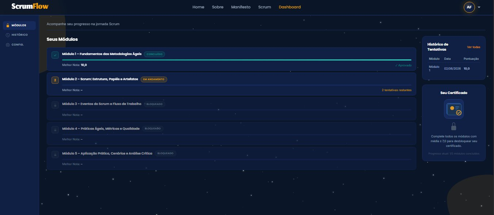
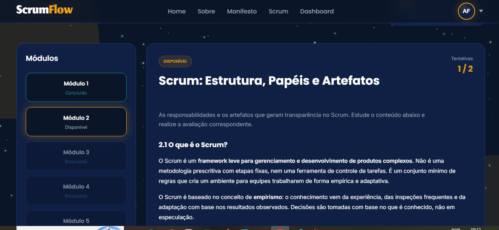
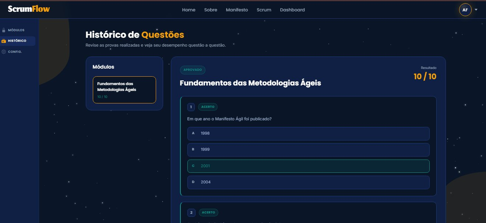

# Visão do Produto — ScrumFlow

← [Índice da Documentação](../README.md) · [Manual do Usuário](./manual-usuario.md)

> **ScrumFlow** é um portal de **certificação interna em metodologias ágeis**. A pessoa estuda, é avaliada por módulos de dificuldade crescente e, ao concluir a trilha, recebe um **certificado digital validável**.

---

## O problema que resolve

Equipes e estudantes precisam consolidar conceitos de Scrum e práticas ágeis — mas falta uma forma estruturada de **aprender, medir a evolução e comprovar o conhecimento**. O ScrumFlow reúne os três numa única plataforma web: conteúdo de estudo, avaliação justa e certificado verificável.

---

## O que o usuário consegue fazer

| | Funcionalidade | Benefício |
|---|---|---|
| 🔐 | **Criar conta e entrar** com CPF e senha | Acesso pessoal e seguro, com dados protegidos (senha criptografada) |
| 📚 | **Estudar 5 módulos** do básico ao avançado | Trilha guiada, do fundamento à aplicação prática |
| 📝 | **Fazer avaliações** de 10 questões sorteadas | Prova diferente a cada tentativa, equilibrada por dificuldade |
| 🔁 | **Repetir até 2 vezes** por módulo | Vale sempre a melhor nota — incentiva aprender, não decorar |
| 📊 | **Acompanhar o progresso** no painel | Vê módulos concluídos, tentativas restantes e melhores notas |
| 🏆 | **Emitir o certificado** ao concluir a trilha | Documento digital com suas notas, pronto para download/impressão |
| ✅ | **Validar um certificado** por link público | Qualquer pessoa confirma a autenticidade pelo código único |
| 🛠️ | **Administrar** questões, módulos e usuários | Equipe mantém o conteúdo sem mexer no banco de dados |

---

## Como se parece

| Página inicial | Painel do usuário |
|:--:|:--:|
|  |  |

| Módulos da trilha | Histórico de tentativas |
|:--:|:--:|
|  |  |

> Quer ver tela a tela como usar? Veja o [Manual do Usuário](./manual-usuario.md).

---

## Como funciona a avaliação (em resumo)

1. Cada módulo tem um banco de **30 questões**; a prova sorteia **10** delas.
2. A composição é sempre equilibrada: **3 fáceis · 4 médias · 3 difíceis**.
3. O usuário tem **2 tentativas** por módulo — conta a **maior nota**.
4. A nota final é a **média** das melhores notas de cada módulo.
5. Toda a contagem de tentativas e o cálculo de notas acontecem **no servidor**, evitando fraudes.

---

## Diferenciais

- **Certificado verificável** — cada certificado tem um código único; qualquer pessoa valida pela URL pública.
- **Avaliação à prova de trapaça** — notas e tentativas controladas no back-end, não no navegador.
- **Conteúdo de estudo integrado** — páginas sobre Scrum e o Manifesto Ágil dentro da própria plataforma.
- **Identidade visual própria** — interface consistente em tema claro/escuro. Veja a [Identidade Visual](../identidade-visual/identidade-visual-scrumflow.md).

---

## Status atual

Plataforma **funcional e publicada**, desenvolvida ao longo de 3 sprints no 1º semestre de 2026. Todos os fluxos descritos acima estão entregues: cadastro, avaliação, resultado, progresso, certificado, histórico e painel administrativo.

🔗 **Aplicação online:** [scrum-flow-abp.onrender.com](https://scrum-flow-abp.onrender.com/)

---

  <a href="../README.md">← Voltar ao Índice</a>

