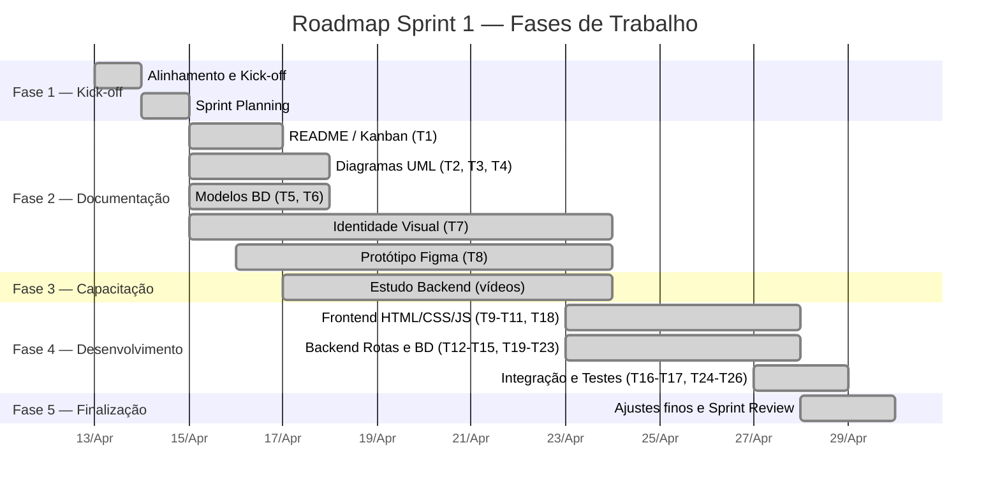

# 📋 Relatório de Contribuição — Sprint 1

← [Índice da Documentação](../../README.md) · [Gestão Ágil — Scrum](../README.md) · [Sprint 1](sprint-1.md) · [Dailies](atas/dailies/)

**Período:** 13/04/2026 — 30/04/2026 (12 dias úteis)  
**Sprint Goal:** Cadastro e Login funcional + documentação técnica completa  
**Resultado:** ✅ 75/75 SP entregues — Burndown zerado em 28/04 (2 dias de antecedência)  
**Dailies realizadas:** 9 de 10 (1 cancelada em 24/04)

---

## Visão Geral do Roadmap

---

## Cronologia Diária

| Data  | Dia | Foco Principal          | Destaques                                                                      |
| :---: | --- | ----------------------- | ------------------------------------------------------------------------------ |
| 13/04 | Seg | 🚀 Kick-off             | Alinhamento inicial, definição de documentação, discussão de identidade visual |
| 14/04 | Ter | 📋 Sprint Planning      | Preparativos e execução da cerimônia de planejamento                           |
| 15/04 | Qua | 📝 Início da execução   | Divisão de tarefas em andamento: README, UML, identidade visual                |
| 16/04 | Qui | 📐 Documentação técnica | Diagramas UML, modelo conceitual BD, protótipo Figma                           |
| 17/04 | Sex | ✅ Docs finalizadas     | Commit dos diagramas e modelos; equipe inicia capacitação backend              |
| 22/04 | Qua | 📚 Capacitação          | Equipe focada em vídeos de backend; identidade visual em refinamento           |
| 23/04 | Qui | 📚 Capacitação (cont.)  | Progresso nos vídeos; commits de identidade visual e protótipo                 |
| 24/04 | Sex | ⚠️ Daily cancelada      | Reunião não realizada                                                          |
| 27/04 | Seg | 💻 Grande avanço dev    | **28 SP concluídos** — T9-T15, T18-T23, T25 finalizados                        |
| 28/04 | Ter | 🏁 Sprint concluída     | Testes de fluxo completo; T16, T17, T24, T26 finalizados; **0 SP restantes**   |

---

## Contribuições por Integrante

### 🎯 Gabriel Travensolli — _Scrum Master_

> **Papel:** Facilitação, organização do repositório, suporte técnico ao time.

| Período  | Atividades                                                                                 |
| -------- | ------------------------------------------------------------------------------------------ |
| 13–14/04 | Alinhamento inicial; estruturação do repositório GitHub; templates Scrum; quadro Kanban    |
| 15–16/04 | Elaboração do `README.md` (T1); documentação da Sprint 1; atas das Dailies 13-15/04        |
| 17/04    | Consolidação e commit dos diagramas UML e modelos de BD                                    |
| 22–23/04 | Estudo de backend (vídeos); auxílio ao Henrique no manual de identidade visual             |
| 27/04    | Implementações de máscara de CPF e token de login; auxílio geral ao time                   |
| 28/04    | Testes de fluxo completo (inicial → cadastro → login); plano de ajustes finos de front-end |

**Tarefas formalmente atribuídas:** T1, T2, T3, T4, T5, T14, T17, T20, T23, T26

**Resumo:** Principal responsável pela organização e infraestrutura do projeto. Atuou como facilitador em todas as Dailies. Além do papel de SM, contribuiu diretamente com código (máscara de CPF, token de login) e testes de fluxo completo.

---

### 📊 Gustavo Koiti — _Product Owner_

> **Papel:** Gestão do backlog, definição de prioridades, contribuição técnica.

| Período | Atividades                                                                             |
| ------- | -------------------------------------------------------------------------------------- |
| 13/04   | Participação no kick-off; discussões sobre Modelo Lógico do BD                         |
| 14/04   | Refinamento do Product Backlog; preparação da Sprint Planning                          |
| 15/04   | Condução do repasse do Backlog na Planning; início da documentação (T1)                |
| 16/04   | Refinamento dos Diagramas de Caso de Uso e Classe (T2, T3); alinhamento com Prof. Sudo |
| 17/04   | Auxílio no commit dos diagramas UML e modelos BD; aprovação de PRs                     |
| 22/04   | **Ausente**                                                                            |
| 23/04   | Organização de conteúdo do curso (manifesto ágil, página inicial)                      |
| 27/04   | Estudo de backend; planejamento de refatoração CSS e rotas                             |
| 28/04   | Edição de HTML e CSS; revisão de documentação para Sprint Review                       |

**Tarefas formalmente atribuídas:** T1, T2, T3, T4, T6, T12, T13, T15, T19, T22, T26

**Resumo:** Conduziu a definição e priorização do backlog. Contribuiu significativamente na documentação técnica (diagramas, modelos) e no desenvolvimento de backend e frontend. 1 ausência registrada (22/04).

---

### 🎨 Andrea Turíbio — _Dev_

> **Papel:** Frontend, UI/UX, identidade visual, backend (estudo e contribuições).

| Período  | Atividades                                                                           |
| -------- | ------------------------------------------------------------------------------------ |
| 13–14/04 | Definição inicial de identidade visual; pesquisa de referências com Lucas e Henrique |
| 15/04    | Definição de paleta e tipografia (T7); planejamento do protótipo Figma               |
| 16/04    | Trilha de aprendizado de backend (Node.js/PostgreSQL)                                |
| 17/04    | Continuação dos vídeos de backend                                                    |
| 22/04    | Continuação dos vídeos de backend                                                    |
| 23/04    | Finalização dos vídeos do Arley; preparação para revisão de código                   |
| 27/04    | Commit da máscara de CPF; commit do `index.js` e remoção do `main.js`                |
| 28/04    | Revisão de HTML e CSS; tarefas de refinamento de código                              |

**Tarefas formalmente atribuídas:** T7, T8, T9, T10, T11, T15, T16, T18, T21, T24

**Resumo:** Atuou fortemente na identidade visual e protótipo no início da sprint. Dedicou um período significativo à capacitação técnica de backend. Na reta final, contribuiu com commits de código (máscara de CPF, index.js) e revisão de frontend.

---

### 🖌️ Henrique Camargo — _Dev_

> **Papel:** Identidade visual, frontend (HTML/CSS), prototipação.

| Período  | Atividades                                                                            |
| -------- | ------------------------------------------------------------------------------------- |
| 13–14/04 | Discussão da identidade visual e UI; análise de propostas                             |
| 15/04    | Validação da identidade visual (T7); organização de assets visuais                    |
| 16/04    | Pesquisa de referências de design; definição de paleta e tipografia                   |
| 17/04    | Elaboração do manual de identidade visual (regras de cores, tipografia)               |
| 22/04    | Análise de modelos de manuais; nova atualização do documento                          |
| 23/04    | Envio do manual de identidade visual para o repositório; início de HTML/CSS           |
| 27/04    | Montagem da estrutura HTML/CSS do projeto; modal de login; testes de login e cadastro |
| 28/04    | Ajustes finos de front-end; login acessível em qualquer página                        |

**Tarefas formalmente atribuídas:** T7, T8, T9, T10, T11, T16, T18, T21, T24

**Resumo:** Principal responsável pelo manual de identidade visual, que consumiu boa parte da sprint. Na segunda metade, migrou para o desenvolvimento frontend, montando a estrutura HTML/CSS, o modal de login e realizando testes de integração. Contribuição significativa nos ajustes finais de UX.

---

### 🎯 Lucas Amorim — _Dev_

> **Papel:** Identidade visual, prototipação (Figma), frontend.

| Período  | Atividades                                                                          |
| -------- | ----------------------------------------------------------------------------------- |
| 13–14/04 | Discussões iniciais de identidade visual; definição de tipografia e paleta de cores |
| 15/04    | Fechamento das definições de design (T7); organização da frente de frontend         |
| 16/04    | Tradução dos conceitos visuais para o protótipo no Figma (fluxo Login/Cadastro)     |
| 17/04    | Finalização e apresentação do protótipo no Figma                                    |
| 22/04    | Correções no protótipo Figma; análise de interações entre frames                    |
| 23/04    | Commit publicando prints do protótipo no Figma                                      |
| 27/04    | Desenvolvimento da landing page; correção de sintaxes incorretas                    |
| 28/04    | Testes de funcionalidade; ajustes sugeridos pelo Scrum Master                       |

**Tarefas formalmente atribuídas:** T7, T8, T9, T10, T11, T16, T18, T21, T24

**Resumo:** Liderou a prototipação no Figma, sendo responsável por traduzir os conceitos de design em wireframes interativos. Após a fase de design, transitou para o desenvolvimento frontend (landing page) e contribuiu com testes de funcionalidade na reta final.

---

### ⚙️ Marcello Campbell — _Dev_

> **Papel:** Backend, modelagem de banco de dados, diagramas UML.

| Período  | Atividades                                                                                                |
| -------- | --------------------------------------------------------------------------------------------------------- |
| 13–14/04 | Discussões sobre modelagem de BD; rascunhos de diagramas (Casos de Uso, Sequência)                        |
| 15/04    | Estruturação do Diagrama de Casos de Uso (T2); mapeamento de Cadastro e Login                             |
| 16/04    | Desenvolvimento do Modelo Conceitual do BD (T5)                                                           |
| 17/04    | Estudo de backend (vídeos); finalização do modelo conceitual para commit                                  |
| 22/04    | Vídeos 3, 4 e início do 5 (criação de exame no BD, refatoração, codificação de senha)                     |
| 23/04    | Refatoração de código e implementação de codificação de senha                                             |
| 27/04    | **Finalização de T12, T13 e T25 (6 SP)** — rotas de cadastro, criptografia bcrypt, conexão frontend login |
| 28/04    | Conclusão de ajustes finos (fix 1 e 2); revisão para entrega                                              |

**Tarefas formalmente atribuídas:** T2, T3, T4, T5, T6, T12, T13, T19, T22, T25

**Resumo:** Pilar técnico do projeto. Responsável pela modelagem de dados (conceitual e lógico) e pelos diagramas UML na primeira fase. Na segunda fase, liderou o desenvolvimento do backend, entregando rotas de cadastro, criptografia de senha e conexão frontend-API. Maior volume de entregas de desenvolvimento em um único dia (27/04).

---

### 🔧 Vinicius Augusto — _Dev_

> **Papel:** Backend, modelagem de BD, diagramas UML, integração.

| Período  | Atividades                                                                                       |
| -------- | ------------------------------------------------------------------------------------------------ |
| 13–14/04 | Estratégias de documentação UML e modelagem de BD                                                |
| 15/04    | Rascunho do Diagrama de Sequência (T4); foco no fluxo de backend                                 |
| 16/04    | Trabalho no Modelo Lógico do BD (T6)                                                             |
| 17/04    | Finalização do modelo lógico de BD para commit                                                   |
| 22/04    | Estudo de backend (vídeos)                                                                       |
| 23/04    | Conclusão do vídeo 4; continuidade nos estudos                                                   |
| 27/04    | Desenvolvimento de backend; commit dos arquivos de backend no GitHub                             |
| 28/04    | Commit das correções de rotas (`get` → `use`); apoio ao time em commits e alterações no servidor |

**Tarefas formalmente atribuídas:** T2, T4, T5, T6, T14, T17, T20, T23, T25

**Resumo:** Contribuiu significativamente na documentação técnica (Diagrama de Sequência, Modelo Lógico do BD) na primeira fase. Na segunda fase, focou na capacitação e posterior desenvolvimento de backend, com destaque para correções de rotas e suporte técnico ao time nos processos de commit e integração.

---

## Análise das Fases de Trabalho

> Dados extraídos do cruzamento entre o **Burndown Chart** (pontos reais por dia) e as **atas das Dailies** (tasks reportadas como concluídas).

---

### Fase 1 — Kick-off e Planejamento (13–14/04)

**Burndown:** 75 → 75 SP · **Concluídos:** 0 SP · **Tasks concluídas:** nenhuma

Dois dias dedicados exclusivamente ao alinhamento e planejamento, sem execução de tasks do backlog.

| Atividade                                                          | Quem participou                             |
| ------------------------------------------------------------------ | ------------------------------------------- |
| Reunião de Kick-off e alinhamento com orientador (Prof. Egydio)    | Toda a equipe                               |
| Definição da documentação necessária (UML, Scrum, BD)              | Toda a equipe                               |
| Discussões iniciais sobre Identidade Visual e modelagem de BD      | Andrea, Henrique, Lucas, Marcello, Vinicius |
| Estruturação do repositório GitHub, templates Scrum, quadro Kanban | Gabriel                                     |
| Refinamento do Product Backlog e preparação da Sprint Planning     | Gustavo                                     |
| **Cerimônia de Sprint Planning** (14/04, 21h30)                    | Toda a equipe                               |

> [!NOTE]
> A Sprint Planning definiu as 26 tasks, distribuiu responsabilidades e estimou os 75 SP. A partir daqui, a equipe se dividiu em duas frentes: **documentação/design** (Andrea, Henrique, Lucas) e **documentação técnica/BD** (Gabriel, Gustavo, Marcello, Vinicius).

---

### Fase 2 — Documentação Técnica (15–17/04)

**Burndown:** 75 → 52 SP · **Concluídos:** 23 SP · **Tasks concluídas:** 6

Fase de produção massiva de documentação. As tasks de DOC (exceto T7 e T8 — identidade visual / protótipo) foram todas finalizadas neste período.

| Task | Descrição                       | Responsáveis                         | Concluída em | SP  |
| :--: | ------------------------------- | ------------------------------------ | :----------: | :-: |
|  T1  | Elaboração `README.md` / Kanban | Gustavo, Gabriel                     |    16/04     |  2  |
|  T2  | Diagramas de Caso de Uso        | Marcello, Vinicius, Gustavo, Gabriel |    17/04     |  5  |
|  T3  | Diagramas de Classe             | Marcello, Gustavo, Gabriel           |    17/04     |  5  |
|  T4  | Diagramas de Sequência          | Marcello, Vinicius, Gustavo, Gabriel |    17/04     |  5  |
|  T5  | Modelo Conceitual do BD         | Marcello, Vinicius, Gabriel          |    17/04     |  3  |
|  T6  | Modelo Lógico do BD             | Marcello, Vinicius, Gustavo          |    17/04     |  3  |

> **T2–T6 totalizam 21 SP** (queimados em 17/04 conforme burndown: 73 → 52).

**Quem fez o quê nesta fase (evidências das Dailies):**

- **Gabriel:** Elaborou o README.md (T1) e documentação da Sprint 1; facilitou a revisão dos diagramas UML e modelos; documentou as atas das Dailies 13–15/04.
- **Gustavo:** Conduziu o repasse do Backlog; trabalhou nos diagramas de Caso de Uso e Classe (T2, T3); alinhou prioridades com o Prof. Sudo; realizou commit e revisão dos diagramas.
- **Marcello:** Estruturou o Diagrama de Casos de Uso (T2); desenvolveu o Modelo Conceitual do BD (T5); finalizou o modelo conceitual para commit.
- **Vinicius:** Rascunhou o Diagrama de Sequência (T4) com foco no fluxo de backend; trabalhou no Modelo Lógico do BD (T6) e finalizou para commit.
- **Andrea, Henrique, Lucas:** Iniciaram os trabalhos de identidade visual (T7) e prototipação Figma (T8), que se estendem para a próxima fase.

---

### Fase 3 — Capacitação e Refinamento Visual (17–23/04)

**Burndown:** 52 → 36 SP · **Concluídos:** 16 SP · **Tasks concluídas:** 2

Período de transição. A equipe técnica se dedicou ao estudo de backend (Node.js, Express, PostgreSQL) através de uma trilha de vídeos, enquanto o time de design finalizava a identidade visual e o protótipo.

| Task | Descrição                         | Responsáveis            | Concluída em | SP  |
| :--: | --------------------------------- | ----------------------- | :----------: | :-: |
|  T7  | Identidade Visual                 | Andrea, Henrique, Lucas |    23/04     |  8  |
|  T8  | Prototipação da Aplicação (Figma) | Andrea, Henrique, Lucas |    23/04     |  8  |

> **T7 + T8 totalizam 16 SP** (queimados em 23/04 conforme burndown: 52 → 36).

**Quem fez o quê nesta fase (evidências das Dailies):**

- **Henrique:** Pesquisou referências e modelos de manuais; elaborou o manual de identidade visual completo (regras de cores, tipografias, design); realizou commit do manual no repositório (23/04).
- **Lucas:** Traduziu conceitos visuais para o Figma; finalizou e apresentou o protótipo (17/04); corrigiu erros de interação entre frames (22/04); publicou prints do protótipo via commit (23/04).
- **Andrea:** Apoiou na definição da identidade visual; dedicou-se à trilha de aprendizado de backend (vídeos do Arley), finalizando em 23/04.
- **Gabriel:** Assistiu vídeos de backend; auxiliou o Henrique na criação do manual de identidade visual.
- **Gustavo:** Organizou conteúdo do curso (manifesto ágil, página inicial). **Ausente na daily de 22/04.**
- **Marcello:** Avançou significativamente nos vídeos de backend (vídeos 3, 4, 5); realizou refatoração de código e implementação de codificação de senha.
- **Vinicius:** Estudou backend através dos vídeos; concluiu o vídeo 4.

> [!IMPORTANT]
> Esta foi a fase mais longa da sprint (~5 dias úteis) e a que gerou menor volume de SP por dia. A capacitação era necessária pois a equipe não tinha experiência prévia com o stack backend, mas concentrou a entrega de código nos últimos 3 dias da sprint.

---

### Fase 4 — Desenvolvimento Intensivo (24–27/04)

**Burndown:** 36 → 8 SP · **Concluídos:** 28 SP · **Tasks concluídas:** 14

A fase mais produtiva da sprint. Em um período que incluiu o fim de semana (25–26/04), a equipe converteu todo o conhecimento adquirido na Fase 3 em código funcional. **14 tasks foram concluídas de uma só vez**, reportadas na daily de 27/04.

| Task | Descrição                                  | Responsáveis            | História | SP  |
| :--: | ------------------------------------------ | ----------------------- | :------: | :-: |
|  T9  | Estrutura do projeto HTML/CSS/JS           | Andrea, Henrique, Lucas |   US01   |  2  |
| T10  | Página de cadastro (HTML + CSS)            | Andrea, Henrique, Lucas |   US01   |  2  |
| T11  | Validação de formulário JS com CPF         | Andrea, Henrique, Lucas |   US01   |  2  |
| T12  | Rota POST de cadastro                      | Marcello, Gustavo       |   US01   |  2  |
| T13  | Criptografia de senha (bcrypt)             | Marcello, Gustavo       |   US01   |  2  |
| T14  | Validar CPF único no backend               | Vinicius, Gabriel       |   US01   |  2  |
| T15  | Script de inicialização do BD (schema.sql) | Andrea, Gustavo         |   US01   |  2  |
| T18  | Página de login (HTML + CSS)               | Andrea, Henrique, Lucas |   US02   |  2  |
| T19  | Rota POST de login                         | Marcello, Gustavo       |   US02   |  2  |
| T20  | Buscar usuário no BD pelo CPF              | Vinicius, Gabriel       |   US02   |  2  |
| T21  | Verificar senha com hash                   | Andrea, Henrique, Lucas |   US02   |  2  |
| T22  | Armazenar JWT/Token no frontend            | Marcello, Gustavo       |   US02   |  2  |
| T23  | Middleware de autenticação                 | Vinicius, Gabriel       |   US02   |  2  |
| T25  | Conectar frontend de login à API           | Marcello, Vinicius      |   US02   |  2  |

> **14 tasks = 28 SP** (queimados entre 24–27/04 conforme burndown: 36 → 8).

**Quem fez o quê nesta fase (evidências das Dailies):**

- **Marcello:** Construiu o backend de forma significativa — **finalizou T12 (rota cadastro), T13 (bcrypt) e T25 (conectar frontend login)**, contabilizando 6 SP diretamente atribuídos a ele. Principal desenvolvedor backend.
- **Henrique:** Montou a estrutura HTML/CSS do projeto; implementou o modal de login; testou os fluxos de login e cadastro.
- **Andrea:** Realizou commit da máscara de CPF; fez commit do `index.js` e removeu o `main.js`.
- **Lucas:** Desenvolveu a landing page inicial; corrigiu sintaxes incorretas.
- **Gabriel:** Implementou máscara de CPF e token de login; auxiliou demais membros nas tasks pendentes.
- **Vinicius:** Desenvolveu backend e realizou commit dos arquivos no GitHub.
- **Gustavo:** Assistiu vídeos de implementação do backend; planejou refatoração de CSS e rotas.

> [!TIP]
> O padrão "estudar → implementar tudo em bloco" funcionou para esta sprint, mas apresenta risco: se o fim de semana tivesse imprevistos, a sprint poderia não ser entregue. A concentração de 28 SP em ~3 dias reflete alta capacidade de execução, mas também alta dependência de um curto período.

---

### Fase 5 — Finalização e Validação (28/04)

**Burndown:** 8 → 0 SP · **Concluídos:** 8 SP · **Tasks concluídas:** 4

Último dia de entregas. Foco em testes end-to-end, integração final e ajustes de UX. Sprint zerada **2 dias antes do prazo** (30/04).

| Task | Descrição                           | Responsáveis            | História | SP  |
| :--: | ----------------------------------- | ----------------------- | :------: | :-: |
| T16  | Conectar API no frontend (fetch)    | Henrique, Lucas         |   US01   |  2  |
| T17  | Teste de fluxo completo de cadastro | Vinicius, Gabriel       |   US01   |  2  |
| T24  | Página inicial / Painel de Módulos  | Andrea, Henrique, Lucas |   US02   |  2  |
| T26  | Teste de fluxo completo de login    | Gustavo, Gabriel        |   US02   |  2  |

> **4 tasks = 8 SP** (queimados em 28/04 conforme burndown: 8 → 0).

**Quem fez o quê nesta fase (evidências das Dailies):**

- **Gabriel:** Realizou testes de fluxo completo (inicial → cadastro → login); verificou páginas antes e depois do login; elaborou plano de ajustes finos de front-end. Responsável direto por **T17 e T26**.
- **Henrique:** Ajustes finos de front-end; implementou login acessível em qualquer página. Responsável por **T16 e T24**.
- **Lucas:** Testes de funcionalidade do site; aplicou ajustes sugeridos pelo Scrum Master. Responsável por **T16 e T24**.
- **Andrea:** Revisão de arquivos HTML e CSS; refinamento de código. Responsável por **T24**.
- **Marcello:** Conclusão de ajustes finos (fix 1 e 2); revisão para entrega.
- **Vinicius:** Commit das correções de rotas (`get` → `use`); apoio ao time em commits e alterações no servidor. Responsável por **T17**.
- **Gustavo:** Edição de HTML/CSS; revisão de documentação para Sprint Review. Responsável por **T26**.

---

### Resumo Comparativo das Fases

| Fase                | Período      | Dias Úteis | SP Entregues | Tasks  | SP/Dia  |
| ------------------- | ------------ | :--------: | :----------: | :----: | :-----: |
| 1 — Kick-off        | 13–14/04     |     2      |      0       |   0    |   0,0   |
| 2 — Documentação    | 15–17/04     |     3      |      23      |   6    |   7,7   |
| 3 — Capacitação     | 17–23/04     |     5      |      16      |   2    |   3,2   |
| 4 — Desenvolvimento | 24–27/04     |    2\*     |      28      |   14   |  14,0   |
| 5 — Finalização     | 28/04        |     1      |      8       |   4    |   8,0   |
| **Total**           | **13–28/04** |   **10**   |    **75**    | **26** | **7,5** |

> \* Inclui o fim de semana (25–26/04), onde parte significativa do desenvolvimento ocorreu de forma assíncrona.

---

## Métricas de Participação nas Dailies

| Membro              | Presença | Taxa |
| ------------------- | :------: | :--: |
| Gabriel Travensolli |   9/9    | 100% |
| Andrea Turíbio      |   9/9    | 100% |
| Henrique Camargo    |   9/9    | 100% |
| Lucas Amorim        |   9/9    | 100% |
| Marcello Campbell   |   9/9    | 100% |
| Vinicius Augusto    |   9/9    | 100% |
| Gustavo Koiti       |   8/9    | 89%  |

> _Excluída a daily de 24/04 que não foi realizada. Gustavo ausente em 22/04._

---

## Observações Finais

> [!TIP]
> A sprint foi concluída com **100% dos story points entregues** e com **2 dias de antecedência**, demonstrando boa capacidade de estimativa e execução do time.

> [!IMPORTANT]
> A fase de capacitação (vídeos de backend) consumiu ~5 dias úteis, o que concentrou a entrega de código nos últimos 3 dias. Para sprints futuras, considerar distribuir melhor a carga de estudo e desenvolvimento.

> [!WARNING]
> US01 foi aceita com ressalva: a responsividade em dispositivos móveis não está satisfatória. Ação registrada para Sprint 2/3.

- **Entregas extras (não planejadas):** Página de manifesto da equipe e página "O que é Scrum"
- **Impedimentos:** Nenhum impedimento técnico foi reportado ao longo de toda a sprint
- **Daily cancelada:** 24/04 — sem impacto no resultado final
- **Ponto de destaque:** 27/04 foi o dia mais produtivo com **28 SP concluídos** de uma só vez

---

  <a href="../../README.md">← Voltar ao Índice</a> · <a href="../README.md">Gestão Ágil — Scrum</a> · <a href="sprint-1.md">Sprint 1</a>

