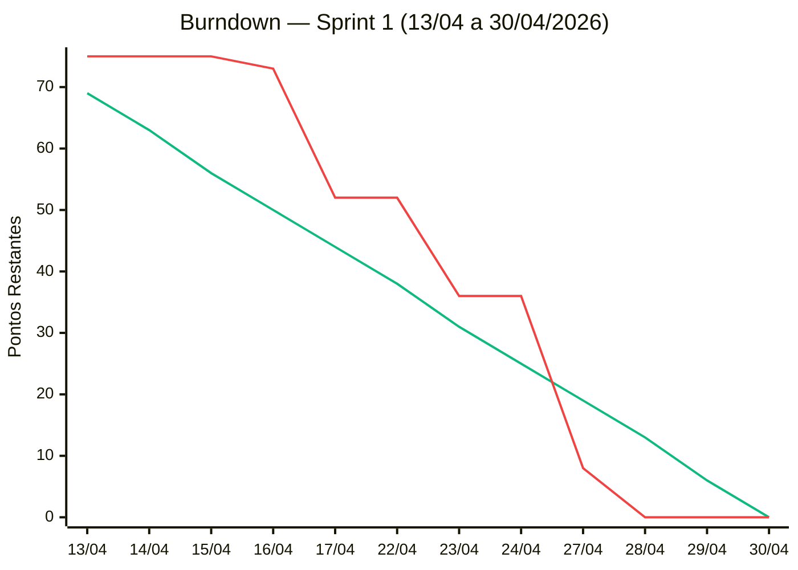

# Sprint 1

← [Índice da Documentação](../../00-INDICE.md)

**Período:** 13/04/2026 — 30/04/2026  
**Sprint Goal:** Ao final desta sprint, qualquer usuário poderá se cadastrar e fazer login na plataforma, com dados validados no front-end, processados no back-end e persistidos no PostgreSQL. Paralelamente, toda a documentação técnica e de produto estará produzida e revisada.  
**Histórias:** DOC, US01, US02  
**Total de pontos comprometidos:** 75 SP  
**Scrum Master:** Gabriel Travensolli  
**Product Owner:** Gustavo Koiti  

---

## Sprint Backlog

### DOC — Documentação da Aplicação

| ID | Tarefa | Responsável | Status |
|----|--------|-------------|:------:|
| T1 | Elaboração `README.md` / Kanban | Gustavo, Gabriel | ✅ |
| T2 | Diagramas de Caso de Uso | Marcello, Vinicius, Gustavo, Gabriel | ✅ |
| T3 | Diagramas de Classe | Marcello, Gustavo, Gabriel | ✅ |
| T4 | Diagramas de Sequência | Marcello, Vinicius, Gustavo, Gabriel | ✅ |
| T5 | Modelo Conceitual do BD | Marcello, Vinicius, Gabriel | ✅ |
| T6 | Modelo Lógico do BD | Marcello, Vinicius, Gustavo | ✅ |
| T7 | Identidade Visual | Andrea, Henrique, Lucas | ✅ |
| T8 | Prototipação da Aplicação (Figma) | Andrea, Henrique, Lucas | ✅ |

### US01 — Cadastro de Usuário

| ID | Tarefa | Responsável | Status |
|----|--------|-------------|:------:|
| T9 | Estrutura do projeto HTML/CSS/JS | Andrea, Henrique, Lucas | ✅ |
| T10 | Página de cadastro (HTML + CSS) | Andrea, Henrique, Lucas | ✅ |
| T11 | Validação de formulário JS com CPF | Andrea, Henrique, Lucas | ✅ |
| T12 | Rota POST de cadastro | Marcello, Gustavo | ✅ |
| T13 | Criptografia de senha no cadastro (bcrypt) | Marcello, Gustavo | ✅ |
| T14 | Validar CPF único no backend | Vinicius, Gabriel | ✅ |
| T15 | Script de inicialização do BD (schema.sql) | Andrea, Gustavo | ✅ |
| T16 | Conectar API no frontend (fetch) | Henrique, Lucas | ✅ |
| T17 | Teste de fluxo completo de cadastro | Vinicius, Gabriel | ✅ |

### US02 — Login

| ID | Tarefa | Responsável | Status |
|----|--------|-------------|:------:|
| T18 | Página de login (HTML + CSS) | Andrea, Henrique, Lucas | ✅ |
| T19 | Rota POST de login | Marcello, Gustavo | ✅ |
| T20 | Buscar usuário no BD pelo CPF | Vinicius, Gabriel | ✅ |
| T21 | Verificar senha com hash | Andrea, Henrique, Lucas | ✅ |
| T22 | Armazenar JWT/Token no frontend | Marcello, Gustavo | ✅ |
| T23 | Middleware de autenticação e proteção de rotas | Vinicius, Gabriel | ✅ |
| T24 | Página inicial / Painel de Módulos | Andrea, Henrique, Lucas | ✅ |
| T25 | Conectar frontend de login à API | Marcello, Vinicius | ✅ |
| T26 | Teste de fluxo completo de login | Gustavo, Gabriel | ✅ |

**Incremento esperado ao final da Sprint:**

- Documentação técnica completa (diagramas UML, modelos de BD, identidade visual, protótipo)
- Usuário consegue se cadastrar e fazer login pelo navegador
- Dados persistidos no banco PostgreSQL via back-end Node.js

---

## Burndown Chart

> **75 SP** distribuídos em **12 dias úteis** (6,25 SP/dia). Linha ideal calculada a partir do Sprint Planning (14/04/2026).  
> Dias não úteis excluídos do eixo: 18–19/04 (fim de semana), 20–21/04 (ponte + Tiradentes), 25–26/04 (fim de semana).

**Legenda:**
- 🟢 Linha ideal (75 → 0 SP)
- 🔴 Linha real

| Data | Dia | Pontos Ideal | Pontos Real | Impedimentos |
|:----:|-----|:------------:|:-----------:|--------------|
| 13/04 | Segunda | 69 | 75 | — |
| 14/04 | Terça | 63 | 75 | — |
| 15/04 | Quarta | 56 | 75 | — |
| 16/04 | Quinta | 50 | 73 | — |
| 17/04 | Sexta | 44 | 52 | — |
| 22/04 | Quarta | 38 | 52 | — |
| 23/04 | Quinta | 31 | 36 | — |
| 24/04 | Sexta | 25 | 36 | Reunião não realizada |
| 27/04 | Segunda | 19 | 8 | — |
| 28/04 | Terça | 13 | 0 | — |
| 29/04 | Quarta | 6 | 0 | — |
| 30/04 | Quinta | 0 | 0 | — |

---

## Cerimônias

| Cerimônia | Ata |
|-----------|-----|
| Sprint Planning | [atas/sprint-planning.md](atas/sprint-planning.md) |
| Sprint Review | [atas/sprint-review.md](atas/sprint-review.md) |
| Sprint Retrospective | [atas/sprint-retrospectiva.md](atas/sprint-retrospectiva.md) |
| Dailies | [atas/dailies/](atas/dailies/) |

> As atas são criadas a partir dos templates em [`templates/`](../templates/).

---

## DoR e DoD

Checklists de entrada (DoR) e conclusão (DoD) das histórias DOC, US01 e US02:

✅ [dor-dod.md](dor-dod.md)

---

## Resultado da Sprint

**Pontos planejados:** 75 SP  
**Pontos entregues (DoD completo):** 75 SP  
**Pontos não entregues:** 0  
**Velocidade da sprint:** 75 pontos  

**Histórias concluídas:** DOC, US01 ⚠️, US02  
**Histórias não entregues:** nenhuma  

### Observações sobre a execução

- Burndown zerado em 28/04, um dia antes do prazo — sprint entregue com antecedência.
- US01 aceita com ressalva: responsividade em dispositivos móveis não está satisfatória. Ação registrada para Sprint 2/3.
- Entregas adicionais além do sprint backlog: página de manifesto da equipe e página "O que é Scrum".
- Impedimento registrado em 24/04 (reunião não realizada) não impactou o resultado final.
