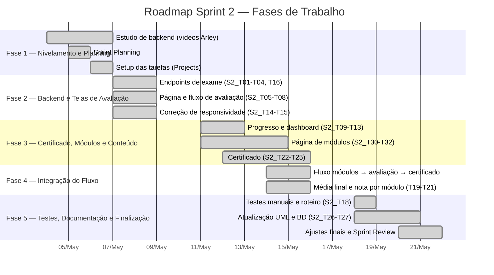

# 📋 Relatório de Contribuição — Sprint 2

← [Índice da Documentação](../../README.md) · [Gestão Ágil — Scrum](../README.md) · [Sprint 2](sprint-2.md) · [Dailies](atas/dailies/)

**Período:** 04/05/2026 — 21/05/2026 (14 dias úteis)  
**Sprint Goal:** Fluxo completo de avaliação — sorteio de questões, controle de tentativas, notas por módulo, média final e certificado digital  
**Resultado:** ✅ 96/96 SP entregues (89 iniciais + 7 de ressalvas) — Burndown zerado em 21/05  
**Dailies realizadas:** 10 de 12 (canceladas em 05/05 — Sprint Planning — e 13/05 — atividades acadêmicas)

---

## Visão Geral do Roadmap

---

## Cronologia Diária

| Data | Dia | Foco Principal | Destaques |
|:----:|-----|----------------|-----------|
| 04/05 | Seg | 📚 Nivelamento técnico | Equipe inteira assiste aos vídeos de backend do Prof. Arley; preparação para a Planning |
| 05/05 | Ter | 📋 Sprint Planning | Cerimônia de planejamento (sem Daily) — definição de 32 tasks e 96 SP |
| 06/05 | Qua | 🔧 Setup da sprint | Consolidação da documentação de início; criação das tarefas no Projects; análise das tratativas |
| 07/05 | Qui | 💻 Início do desenvolvimento | Primeiros endpoints de exame; `avaliacao.html`; início da correção de responsividade |
| 08/05 | Sex | 🚀 Grande avanço | **43 SP queimados em 2 dias** — páginas de avaliação/resultado/dashboard e backend de exame |
| 11/05 | Seg | 🧩 Módulos e certificado | Backend concluído; início da página de módulos e da feature de certificado |
| 12/05 | Ter | 📝 Conteúdo e fluxo | Material didático dos módulos; lógica de progressão; repository de certificado |
| 13/05 | Qua | ⚠️ Daily cancelada | Dedicação a atividades acadêmicas — sem reunião |
| 14/05 | Qui | 🔗 Integração de fluxo | Ligação módulos → avaliação → certificado; conteúdos oficiais; ajuste de UML/BD |
| 15/05 | Sex | 🎓 Certificado e fluxo | **17 SP queimados** — página de certificado; ligação módulo↔prova concluída; modelo lógico |
| 18/05 | Seg | 🧪 Testes e documentação | Relatório de testes manuais (S2_T18); testes de UX/UI; início da atualização UML |
| 19/05 | Ter | 📐 Documentação UML | Diagramas de classe e sequência em `.puml` para o Astah (Vinicius ausente) |
| 20–21/05 | Qua–Qui | 🏁 Sprint concluída | Ajustes finais e **Sprint Review** assíncrona; **0 SP restantes** |

---

## Contribuições por Integrante

### 🎯 Gabriel Travensolli — *Scrum Master*

> **Papel:** Facilitação, lógica de sorteio/tentativas, infraestrutura e documentação técnica.

| Período | Atividades |
|---------|-----------|
| 04–06/05 | Estudo de backend (vídeos do Arley); consolidação da documentação de início da Sprint 2; criação das tarefas no Projects |
| 07–08/05 | Alinhamento com Marcello, Gustavo e Vinicius para as tasks de sorteio e tentativas; continuidade do estudo de backend |
| 11/05 | Revisão da lógica de selecionar/responder questões, criar nova tentativa, avançar módulo e visualizar módulos respondidos (S2_T03) |
| 12/05 | Auxílio ao Lucas no versionamento da feature de certificado; alinhamento com Henrique sobre a exibição de imagens das questões; estudo dos ajustes de UML e BD |
| 14–15/05 | Alinhamento do fluxo módulos → avaliação → certificado; definição das novas tarefas da página de módulos; acompanhamento da S2_T18 |
| 18–19/05 | Verificação do relatório de testes (S2_T18); testes de UX; elaboração dos diagramas de classe e sequência em `.puml` para o Astah |

**Tarefas formalmente atribuídas:** S2_T03, S2_T04, S2_T10, S2_T17, S2_T18, S2_T20, S2_T26, S2_T27, S2_T28, S2_T32

**Resumo:** Facilitou todas as 10 Dailies e manteve o burndown atualizado. Responsável pela revisão da lógica de sorteio e tentativas, pela infraestrutura (migration, coluna de pontuação) e por boa parte da documentação técnica (UML, BD, README), elaborando os diagramas em `.puml` na reta final.

---

### 📊 Gustavo Koiti — *Product Owner*

> **Papel:** Gestão do backlog, endpoints de avaliação/progresso/certificado, conteúdo dos módulos.

| Período | Atividades |
|---------|-----------|
| 04–06/05 | Estudo de backend; revisão da documentação de início da Sprint 2 para commit; estudo das tasks de endpoint (S2_T01, S2_T02) |
| 07–08/05 | Atualização do `server.js` para os questionários dos módulos; conclusão dos vídeos e preparação dos arquivos de backend |
| 11–12/05 | Complemento e refatoração dos arquivos de backend; produção do material de aula dos módulos; organização do módulo 3 |
| 14–15/05 | Edição das páginas de material; refatoração da estrutura HTML; reunião com o Arley sobre desagregação de código; preparação do MVP para a Review |
| 18–19/05 | Nova tentativa de refatoração das páginas HTML; atualização dos diagramas UML |

**Tarefas formalmente atribuídas:** S2_T01, S2_T02, S2_T09, S2_T11, S2_T16, S2_T19, S2_T22, S2_T28, S2_T29, S2_T32

**Resumo:** Conduziu a priorização do backlog e a revisão do Product Backlog (S2_T29). Contribuiu fortemente no backend (endpoints de exame, progresso e certificado) e produziu o conteúdo oficial de aula dos módulos. Registrou impedimento de carregamento de HTML refatorado em 14/05, resolvido na sequência.

---

### 🎨 Andrea Turíbio — *Dev*

> **Papel:** Páginas de avaliação/dashboard/certificado, responsividade, página de módulos.

| Período | Atividades |
|---------|-----------|
| 04–06/05 | Estudo dos vídeos novos do Arley; alinhamento de front-end com Henrique e Lucas |
| 07–08/05 | Montagem da página `avaliacao.html` (S2_T05) e do `avaliacao.css` (S2_T08) |
| 11/05 | Estudo dos códigos e dos vídeos; em espera pelas próximas tasks |
| 12/05 | Construção do material didático dos módulos; início do fluxo de navegação (S2_T13) |
| 14–15/05 | Revisão de código; construção do *footer*; trabalho no visual da página e commit (S2_T13) |
| 18–19/05 | Testes de experiência do usuário da versão atual; estudo de conteúdo de Scrum |

**Tarefas formalmente atribuídas:** S2_T05, S2_T06, S2_T08, S2_T12, S2_T13, S2_T15, S2_T19, S2_T21, S2_T25, S2_T30, S2_T31

**Resumo:** Atuou na linha de frente do front-end, entregando a página e o CSS de avaliação, o fluxo de navegação e a estrutura visual da página de módulos. Contribuiu também com a responsividade (breakpoints mobile-first) e os testes de UX. Registrou impedimento de cansaço em 19/05.

---

### 🖌️ Henrique Camargo — *Dev*

> **Papel:** Front-end de avaliação/resultado/certificado, correções de responsividade.

| Período | Atividades |
|---------|-----------|
| 04–06/05 | Estudo dos vídeos do Arley; análise das tratativas de correção da responsividade |
| 07–08/05 | Correção da responsividade nas páginas (S2_T14/S2_T15); criação da página de resultado da avaliação (S2_T07) |
| 11–12/05 | Estudo dos vídeos; alinhamento da `avaliacao.html` com o banco; ligação módulos → avaliação |
| 14–15/05 | Conclusão da ligação entre módulo e prova; criação da página de certificado HTML e método de teste (S2_T24) |
| 18–19/05 | Testes de UX/UI na aplicação; estudo de melhorias e refinamentos para a Sprint 3 |

**Tarefas formalmente atribuídas:** S2_T05, S2_T07, S2_T08, S2_T12, S2_T14, S2_T15, S2_T24, S2_T25, S2_T30

**Resumo:** Responsável pela tela de resultado imediato, pela página de certificado e por grande parte da correção de responsividade (ressalva herdada da Sprint 1). Fez a ligação técnica entre os módulos e a avaliação e liderou os testes de UX/UI no encerramento da sprint.

---

### 🎯 Lucas Amorim — *Dev*

> **Papel:** Fluxo de questões, navegação, certificado, responsividade.

| Período | Atividades |
|---------|-----------|
| 04–06/05 | Estudo dos vídeos do Arley; análise das tratativas das tarefas iniciais |
| 07–08/05 | Ajuste do CSS do `index` para responsividade (S2_T14); correção das figuras da página principal; finalização das páginas do dashboard (S2_T12) |
| 11–12/05 | Mudanças no dashboard; início do front-end de histórico de avaliações; trabalho no certificado na área de *repositories* |
| 14–15/05 | Revisão do dashboard e suas rotas; ajustes de ligação e CSS; layout responsivo do dashboard |
| 18–19/05 | Revisão de código; estudo das bibliotecas utilizadas e dos vídeos do Arley |

**Tarefas formalmente atribuídas:** S2_T06, S2_T07, S2_T08, S2_T12, S2_T13, S2_T14, S2_T21, S2_T24, S2_T31

**Resumo:** Contribuiu no fluxo de questões da avaliação, no dashboard e no certificado. Atuou na correção de responsividade do `index` e na navegação entre páginas, além de apoiar a feature de certificado na camada de *repositories*.

---

### ⚙️ Marcello Campbell — *Dev*

> **Papel:** Endpoints de exame/certificado, repositórios, diagramas UML.

| Período | Atividades |
|---------|-----------|
| 04–06/05 | Estudo dos vídeos do Arley; análise das tratativas dos endpoints (S2_T01, S2_T02) |
| 07–08/05 | Desenvolvimento do backend — endpoint GET de questões (S2_T01); conclusão dos vídeos 12, 13 e 14 |
| 11/05 | Conclusão do backend; revisão de código; estudo da arquitetura de pastas e da função de cada arquivo |
| 12/05 | Refatoração de arquivos HTML, CSS e JS no que diz respeito ao front-end e às questões |
| 14–15/05 | Revisão do front-end e da documentação UML; atualização do modelo lógico e do `questoes.css` |
| 18–19/05 | Testes de experiência do usuário; estudo da estrutura JS do front-end; suporte ao Astah; conclusão da apresentação da Sprint 2 |

**Tarefas formalmente atribuídas:** S2_T01, S2_T02, S2_T04, S2_T09, S2_T16, S2_T22, S2_T23, S2_T26

**Resumo:** Principal desenvolvedor backend da sprint — entregou os endpoints de exame, progresso e certificado e os respectivos repositórios. Concluiu a trilha de vídeos cedo e, na segunda metade, migrou para a refatoração de front-end e a atualização dos diagramas UML.

---

### 🔧 Vinicius Augusto — *Dev*

> **Papel:** Validação server-side, repositórios, página de módulos, documentação.

| Período | Atividades |
|---------|-----------|
| 04–06/05 | Estudo dos vídeos do Arley; análise das tratativas de backend com Gustavo, Marcello e Gabriel |
| 07–08/05 | Implementação da validação/estrutura de backend seguindo os padrões do repositório (S2_T10); continuidade da estrutura inicial do BD |
| 11/05 | Estudo dos vídeos; início da página `modulos.html` (S2_T30) |
| 12–14/05 | Lógica dinâmica de progressão dos módulos, validação de tentativas e bloqueio/liberação (S2_T31); inserção dos conteúdos oficiais; ajustes no repository de certificados e integração via hash (S2_T23) |
| 15/05 | Commits de ajustes da página de módulos (HTML, JS e CSS) — progressão, tentativas e organização visual |
| 18/05 | Finalização do relatório de testes manuais e do roteiro de documentação do fluxo (S2_T18) |
| 19/05 | **Ausente** |

**Tarefas formalmente atribuídas:** S2_T03, S2_T10, S2_T11, S2_T17, S2_T18, S2_T20, S2_T23, S2_T26, S2_T27

**Resumo:** Responsável pela validação server-side do limite de tentativas, pelos repositórios e pela média final, além de ter implementado integralmente a lógica da página de módulos (item de escopo adicional). Produziu o relatório de testes manuais (S2_T18) que embasou a atualização da documentação. 1 ausência registrada (19/05).

---

## Análise das Fases de Trabalho

> Dados extraídos do cruzamento entre o **Burndown Chart** (pontos reais por dia) e as **atas das Dailies** (tasks reportadas como concluídas).

---

### Fase 1 — Nivelamento e Planejamento (04–06/05)

**Burndown:** 96 → 96 SP · **Concluídos:** 0 SP

Três dias de nivelamento técnico e organização. A equipe inteira concluiu a trilha de vídeos de backend do Prof. Arley antes de iniciar o desenvolvimento, evitando o gargalo de capacitação tardia observado na Sprint 1.

| Atividade | Quem participou |
|-----------|----------------|
| Estudo dos vídeos de implementação de backend (Arley) | Toda a equipe |
| **Cerimônia de Sprint Planning** (05/05, 21h20) | Toda a equipe |
| Consolidação da documentação de início e criação das tarefas no Projects | Gabriel |
| Revisão da documentação de início para commit | Gustavo |
| Análise das tratativas de front-end e back-end | Andrea, Henrique, Lucas, Vinicius |

> [!NOTE]
> A Sprint Planning definiu 32 tasks e estimou 96 SP (89 iniciais + 7 de ressalvas de escopo). A daily de 05/05 não foi realizada para dar lugar à cerimônia de planejamento.

---

### Fase 2 — Backend e Telas de Avaliação (07–08/05)

**Burndown:** 96 → 53 SP · **Concluídos:** 43 SP

A fase mais produtiva da sprint. Com o nivelamento já concluído, a equipe converteu o conhecimento em código em apenas dois dias, atacando simultaneamente o backend de exame, as telas de avaliação e a correção de responsividade herdada da Sprint 1.

| Frente | Tasks | Responsáveis |
|--------|-------|--------------|
| Endpoints de exame (questões, respostas, iniciar avaliação) | S2_T01, S2_T02, S2_T03, S2_T04, S2_T16 | Marcello, Gustavo, Vinicius, Gabriel |
| Páginas de avaliação e resultado | S2_T05, S2_T06, S2_T07, S2_T08 | Andrea, Henrique, Lucas |
| Correção de responsividade *(ressalva S1)* | S2_T14, S2_T15 | Henrique, Lucas, Andrea |
| Dashboard e migration | S2_T12, S2_T17 | Lucas, Vinicius, Gabriel |

**Quem fez o quê nesta fase (evidências das Dailies):**

- **Marcello:** Implementou o endpoint GET de questões e avançou no backend; concluiu os vídeos 12–14.
- **Gustavo:** Atualizou o `server.js` para os questionários e preparou os arquivos de backend.
- **Andrea:** Finalizou a `avaliacao.html` e o `avaliacao.css`.
- **Henrique:** Corrigiu a responsividade das páginas e criou a página de resultado da avaliação.
- **Lucas:** Tornou o CSS do `index` responsivo e finalizou as páginas do dashboard.
- **Vinicius:** Implementou a validação/estrutura de backend seguindo os padrões do repositório.

---

### Fase 3 — Certificado, Módulos e Conteúdo (11–12/05)

**Burndown:** 53 → 38 SP · **Concluídos:** 15 SP

Com o backend praticamente concluído, a equipe iniciou as features de maior complexidade: o certificado digital e a página de módulos (item de escopo adicional), além do material didático oficial.

| Frente | Tasks | Responsáveis |
|--------|-------|--------------|
| Endpoints de progresso e repositórios | S2_T09, S2_T11 | Marcello, Gustavo, Vinicius |
| Página de módulos (estrutura e lógica) | S2_T30, S2_T31 | Vinicius, Andrea |
| Certificado (repository) | S2_T23 | Marcello, Vinicius, Lucas |
| Conteúdo oficial dos módulos | S2_T32 | Gustavo, Andrea, Gabriel |

**Quem fez o quê nesta fase (evidências das Dailies):**

- **Marcello:** Concluiu o backend, revisou o código e estudou a arquitetura de pastas; refatorou front-end e questões.
- **Gustavo:** Complementou e refatorou o backend; produziu o material de aula dos módulos.
- **Vinicius:** Iniciou a página `modulos.html` e implementou a lógica de progressão, validação de tentativas e bloqueio/liberação.
- **Andrea:** Construiu o material didático e iniciou o fluxo de navegação.
- **Lucas:** Trabalhou nos acabamentos do dashboard e no certificado na área de *repositories*.
- **Gabriel:** Auxiliou no versionamento da feature de certificado e alinhou a exibição de imagens das questões.

---

### Fase 4 — Integração do Fluxo (13–15/05)

**Burndown:** 38 → 13 SP · **Concluídos:** 25 SP

Fase de integração ponta a ponta. As features isoladas foram costuradas no fluxo **módulos → avaliação → certificado**, e as histórias de nota por módulo (US05) e média final (US06) foram concluídas. A daily de 13/05 não foi realizada (atividades acadêmicas).

| Frente | Tasks | Responsáveis |
|--------|-------|--------------|
| Fluxo de navegação e ligação entre páginas | S2_T13, S2_T24 | Andrea, Lucas, Henrique |
| Nota por módulo e média final | S2_T19, S2_T20, S2_T21 | Andrea, Gustavo, Vinicius, Gabriel, Lucas |
| Página de módulos (conteúdo e progressão) | S2_T31, S2_T32 | Vinicius, Andrea |
| Página de certificado | S2_T24, S2_T25 | Henrique, Andrea |

**Quem fez o quê nesta fase (evidências das Dailies):**

- **Henrique:** Concluiu a ligação entre módulo e prova; criou a página de certificado HTML com método de teste.
- **Vinicius:** Finalizou a lógica dinâmica da página de módulos e inseriu os conteúdos oficiais; ajustou o repository de certificados (validação via hash).
- **Andrea:** Trabalhou no fluxo de navegação, no *footer* e no visual da página.
- **Lucas:** Revisou o dashboard, suas rotas e o layout responsivo.
- **Marcello:** Revisou o front-end e a documentação UML; atualizou o modelo lógico e o `questoes.css`.
- **Gabriel:** Alinhou o fluxo entre as páginas e definiu as novas tarefas da página de módulos.
- **Gustavo:** Editou as páginas de material e refatorou a estrutura HTML.

> [!IMPORTANT]
> Esta fase concentrou a integração de todas as histórias em cascata (US03 → US07). O risco de dependência identificado na Planning se confirmou, mas a priorização de US03 e da infraestrutura (S2_T16/S2_T17) no início da sprint permitiu que a integração ocorresse sem bloqueios.

---

### Fase 5 — Testes, Documentação e Finalização (18–21/05)

**Burndown:** 13 → 0 SP · **Concluídos:** 13 SP

Último trecho da sprint. Foco em testes de UX/UI, no relatório de testes manuais e na atualização da documentação técnica (UML, BD e README). Sprint zerada em 21/05, no dia da Review.

| Frente | Tasks | Responsáveis |
|--------|-------|--------------|
| Testes manuais e roteiro de documentação | S2_T18 | Vinicius, Gabriel |
| Diagramas UML (Caso de Uso, Classe, Sequência) | S2_T26 | Gabriel, Marcello, Vinicius, Gustavo |
| Modelos de BD (conceitual + lógico) | S2_T27 | Gabriel, Vinicius |
| README e Product Backlog | S2_T28, S2_T29 | Gabriel, Gustavo |

**Quem fez o quê nesta fase (evidências das Dailies):**

- **Vinicius:** Finalizou o relatório de testes manuais e o roteiro de documentação do fluxo (S2_T18). **Ausente na daily de 19/05.**
- **Gabriel:** Verificou o relatório de testes; realizou testes de UX; elaborou os diagramas de classe e sequência em `.puml` para o Astah.
- **Gustavo:** Nova refatoração das páginas HTML; atualização dos diagramas UML.
- **Marcello:** Testes de UX; estudo da estrutura JS do front-end; suporte ao Astah; conclusão da apresentação da Sprint 2.
- **Andrea:** Testes de experiência do usuário; estudo de conteúdo de Scrum. **Impedimento de cansaço registrado em 19/05.**
- **Henrique:** Testes de UX/UI; estudo de melhorias para a Sprint 3.
- **Lucas:** Revisão de código e estudo das bibliotecas utilizadas.

---

### Resumo Comparativo das Fases

| Fase | Período | Dias Úteis | SP Entregues | SP/Dia |
|------|---------|:----------:|:------------:|:------:|
| 1 — Nivelamento e Planning | 04–06/05 | 3 | 0 | 0,0 |
| 2 — Backend e Avaliação | 07–08/05 | 2 | 43 | 21,5 |
| 3 — Certificado e Módulos | 11–12/05 | 2 | 15 | 7,5 |
| 4 — Integração do Fluxo | 13–15/05 | 3 | 25 | 8,3 |
| 5 — Testes e Documentação | 18–21/05 | 4 | 13 | 3,3 |
| **Total** | **04–21/05** | **14** | **96** | **6,9** |

> O início mais lento (planning sem daily nos primeiros dias) foi compensado por uma forte aceleração na transição da primeira para a segunda semana — 43 SP em 07–08/05.

---

## Métricas de Participação nas Dailies

| Membro | Presença | Taxa |
|--------|:--------:|:----:|
| Gabriel Travensolli | 10/10 | 100% |
| Gustavo Koiti | 10/10 | 100% |
| Andrea Turíbio | 10/10 | 100% |
| Henrique Camargo | 10/10 | 100% |
| Lucas Amorim | 10/10 | 100% |
| Marcello Campbell | 10/10 | 100% |
| Vinicius Augusto | 9/10 | 90% |

> *Excluídas as dailies de 05/05 (Sprint Planning) e 13/05 (não realizada — atividades acadêmicas). Vinicius ausente em 19/05; Andrea presente em 19/05 com impedimento de cansaço.*

---

## Observações Finais

> [!TIP]
> A sprint foi concluída com **100% dos story points entregues** (96/96), incluindo os 7 SP de ressalvas herdadas da Sprint 1 e itens extras de escopo (página de módulos com progressão dinâmica e conteúdo oficial).

> [!IMPORTANT]
> O nivelamento técnico antecipado (vídeos de backend concluídos já na Fase 1) corrigiu o gargalo de capacitação tardia da Sprint 1 e permitiu o pico de 43 SP em apenas dois dias na Fase 2.

> [!WARNING]
> **Ressalva aceita pelo PO:** a responsividade funciona em dispositivos móveis, mas é instável no redimensionamento da janela do navegador — endereçada na Sprint 3. Também foi identificada a não renderização das imagens de algumas questões (corrigida na Sprint 3).

- **Entregas extras (não planejadas inicialmente):** página de módulos com lógica dinâmica de progressão (S2_T30, S2_T31) e inserção dos conteúdos oficiais dos módulos (S2_T32) — 7 SP de escopo adicional.
- **Impedimentos:** carregamento de HTML refatorado (Gustavo, 14/05, resolvido); cansaço (Andrea, 19/05).
- **Dailies canceladas:** 05/05 (Sprint Planning) e 13/05 (atividades acadêmicas) — sem impacto no resultado final.
- **Ponto de destaque:** 07–08/05 foi o período mais produtivo, com **43 SP concluídos** em dois dias.
- **Validação:** todas as histórias aceitas pelo PO na [Sprint Review](atas/sprint-review.md) de 21/05. Incremento funcional disponível em [scrum-flow-abp.onrender.com](https://scrum-flow-abp.onrender.com/).

---

  <a href="../../README.md">← Voltar ao Índice</a> · <a href="../README.md">Gestão Ágil — Scrum</a> · <a href="sprint-2.md">Sprint 2</a>

