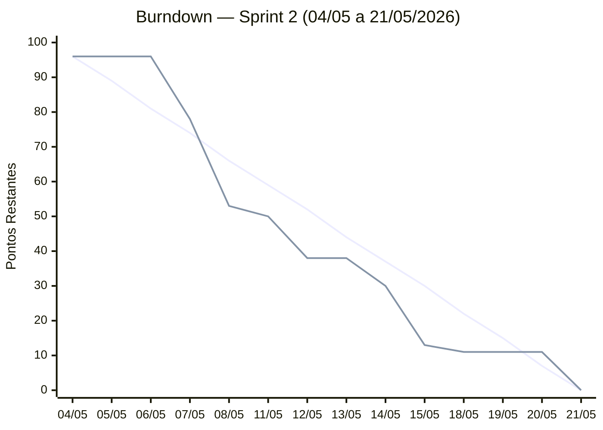

← [Índice da Documentação](../../README.md) · [Gestão Ágil — Scrum](../README.md)

# Sprint 2

**Período:** 04/05/2026 — 21/05/2026
**Sprint Goal:** _Entregar o fluxo completo de avaliação — sorteio de questões, controle de tentativas, notas por módulo, média final e certificado digital._
**Histórias:** US03, US04, US05, US06, US07
**Total de pontos comprometidos:** 96 SP (89 iniciais + 7 ressalvas)
**Scrum Master:** Gabriel Travensolli
**Product Owner:** Gustavo Koiti

---

## Sprint Backlog

| # | Tarefa | Grupo/História | Responsável | SP | Status |
|:-:|--------|:--------------:|-------------|:--:|:------:|
| S2_T01 | Endpoint GET /api/exames/:idExame/questoes | US03 | Marcello + Gustavo | 3 | ✅ |
| S2_T02 | Endpoint POST /api/exames/:idExame/respostas | US03 | Marcello + Gustavo | 5 | ✅ |
| S2_T03 | Revisar lógica de sortear questões | US03 | Vinicius + Gabriel | 3 | ✅ |
| S2_T04 | Repository: exames.repositories.js | US03 | Marcello + Gabriel | 3 | ✅ |
| S2_T05 | Página: avaliacao.html | US03 | Andrea + Henrique | 3 | ✅ |
| S2_T06 | Fluxo de questões em avaliacao.js | US03 | Andrea + Lucas | 5 | ✅ |
| S2_T07 | Tela de resultado imediato após submissão | US03 | Henrique + Lucas | 3 | ✅ |
| S2_T08 | CSS: pages/avaliacao.css | US03 | Andrea + Henrique + Lucas | 2 | ✅ |
| S2_T09 | Endpoint GET /api/usuarios/progresso | US04 | Marcello + Gustavo | 5 | ✅ |
| S2_T10 | Validação server-side em POST /api/exames (limite 2 tentativas) | US04 | Vinicius + Gabriel | 3 | ✅ |
| S2_T11 | Repository: progresso.repositories.js | US04 | Gustavo + Vinicius | 3 | ✅ |
| S2_T12 | Atualizar dashboard.html + dashboard.js | US04 | Andrea + Henrique + Lucas | 3 | ✅ |
| S2_T13 | Fluxo de navegação: dashboard → avaliacao → resultado | US04 | Andrea + Lucas | 2 | ✅ |
| S2_T14 | Revisar index.html / index.css — responsividade mobile *(ressalva S1)* | Correção | Henrique + Lucas | 2 | ✅ |
| S2_T15 | Breakpoints consistentes em global.css (mobile-first) *(ressalva S1)* | Correção | Andrea + Henrique | 2 | ✅ |
| S2_T16 | Endpoint POST /api/exames (iniciar avaliação + sortear questões) | Infra | Marcello + Gustavo | 5 | ✅ |
| S2_T17 | Coluna pontuacao em exames + migration SQL | Infra | Vinicius + Gabriel | 3 | ✅ |
| S2_T18 | Testes manuais + roteiro de documentação do fluxo | Infra | Vinicius + Gabriel | 2 | ✅ |
| S2_T19 | Exibir nota final por módulo no dashboard | US05 | Andrea + Gustavo | 2 | ✅ |
| S2_T20 | Endpoint/lógica backend para calcular média final | US06 | Vinicius + Gabriel | 3 | ✅ |
| S2_T21 | Exibir média final no dashboard (condicional) | US06 | Andrea + Lucas | 2 | ✅ |
| S2_T22 | Endpoint POST /api/certificados (gerar + persistir) | US07 | Marcello + Gustavo | 5 | ✅ |
| S2_T23 | Repository: certificados.repositories.js | US07 | Marcello + Vinicius | 3 | ✅ |
| S2_T24 | Página certificado.html + certificado.js | US07 | Henrique + Lucas | 3 | ✅ |
| S2_T25 | CSS do certificado (layout + suporte a exportação/print) | US07 | Andrea + Henrique | 2 | ✅ |
| S2_T26 | Atualizar diagramas UML (Caso de Uso, Classe e Sequência) | Doc | Marcello + Vinicius + Gabriel | 5 | ✅ |
| S2_T27 | Atualizar modelos BD (conceitual + lógico) — novas tabelas | Doc | Gabriel + Vinicius | 3 | ✅ |
| S2_T28 | Atualizar README.md — status Sprint 2, novas rotas e telas | Doc | Gabriel + Gustavo | 2 | ✅ |
| S2_T29 | Revisar e atualizar Product Backlog — status das USs | Doc | Gustavo | 2 | ✅ |
| S2_T30 | Criar estrutura visual da página de módulos | US04 | Andrea + Henrique | 2 | ✅ |
| S2_T31 | Implementar lógica dinâmica e progressão dos módulos | US04 | Andrea + Lucas | 3 | ✅ |
| S2_T32 | Inserir conteúdos oficiais dos módulos ScrumFlow | US04 | Gustavo + Gabriel | 2 | ✅ |

**Incremento esperado ao final da Sprint:**

- Usuário consegue iniciar e completar uma avaliação com 10 questões sorteadas por módulo
- Sistema controla e bloqueia após 2 tentativas, considerando sempre a maior nota
- Notas por módulo e média final exibidas no dashboard
- Certificado digital gerado e persistido após conclusão de todos os módulos
- Todas as páginas com responsividade mobile corrigida
- Diagramas UML e modelos de BD atualizados com as novas entidades

---

## Burndown Chart

> Atualizado diariamente pelo Scrum Master ao final de cada Daily.

**Como atualizar o gráfico:**
1. Edite a segunda linha `line [...]` do bloco Mermaid abaixo substituindo cada valor pelo total de pontos **restantes** naquele dia
2. Preencha a mesma informação na coluna **Pontos Real** da tabela de acompanhamento
3. Ajuste o intervalo do `y-axis` conforme necessário

> 🔵 **Linha 1 — Ideal:** queima linear esperada (não editar)
> 🟠 **Linha 2 — Real:** substituir os `89` pelos pontos efetivamente restantes a cada dia

| Dia | Data | Dia da semana | Pontos Ideal | Pontos Real | Impedimentos |
|:---:|:----:|:-------------:|:------------:|:-----------:|:-------------|
| 1  | 04/05 | Segunda | 96 | 96 | — |
| 2  | 05/05 | Terça   | 89 | 96 | Sprint Planning (Sem Daily) |
| 3  | 06/05 | Quarta  | 81 | 96 | — |
| 4  | 07/05 | Quinta  | 74 | 78 | — |
| 5  | 08/05 | Sexta   | 66 | 53 | — |
| 6  | 11/05 | Segunda | 59 | 50 | — |
| 7  | 12/05 | Terça   | 52 | 38 | — |
| 8  | 13/05 | Quarta  | 44 | 38 | (Sem Daily) |
| 9  | 14/05 | Quinta  | 37 | 30 | — |
| 10 | 15/05 | Sexta   | 30 | 13 | — |
| 11 | 18/05 | Segunda | 22 | 11 | — |
| 12 | 19/05 | Terça   | 15 | 11 | — |
| 13 | 20/05 | Quarta  |  7 | 11 | — |
| 14 | 21/05 | Quinta  |  0 |  0 | — |

---

## Cerimônias

| Cerimônia | Ata |
|-----------|-----|
| Sprint Planning | [atas/sprint-planning.md](atas/sprint-planning.md) |
| Sprint Review | [atas/sprint-review.md](atas/sprint-review.md) |
| Sprint Retrospective | [atas/sprint-retrospectiva.md](atas/sprint-retrospectiva.md) |
| Dailies | [atas/dailies/](atas/dailies/) |

> As atas são criadas a partir dos templates em [`templates/`](../templates/).

---

## DoR e DoD

Checklists de entrada (DoR) e conclusão (DoD) das histórias desta sprint:

[dor-dod.md](dor-dod.md)

---

## Documentos Complementares

| Documento | Descrição |
|---|---|
| [relatorio-contribuicao-2.md](relatorio-contribuicao-2.md) | Participação da equipe por integrante e frentes de trabalho |

---

## Resultado da Sprint

Validado na [Sprint Review](atas/sprint-review.md) de 21/05/2026.

**Pontos planejados:** 96 (89 iniciais + 7 de ressalvas da Sprint 1)
**Pontos entregues (DoD completo):** 96
**Pontos não entregues:** 0
**Velocidade da sprint:** 96 pontos

**Histórias concluídas:** US03, US04, US05, US06, US07 — todas as histórias comprometidas, mais itens de infra, documentação e correções da Sprint 1.
**Histórias não entregues (e motivo):** nenhuma.

### Observações sobre a execução

- Burndown encerrou em **0 SP no dia 21/05** (aproveitamento de 100%), com início mais lento (planning sem daily nos primeiros dias) e aceleração na segunda semana.
- **Ressalva aceita pelo PO:** a responsividade funciona em dispositivos móveis, mas é instável no redimensionamento da janela — endereçada na Sprint 3.
- Pendência identificada: imagens de algumas questões não renderizavam (corrigida na Sprint 3).

---

  <a href="../../README.md">← Voltar ao Índice</a> · <a href="../README.md">Gestão Ágil — Scrum</a>

