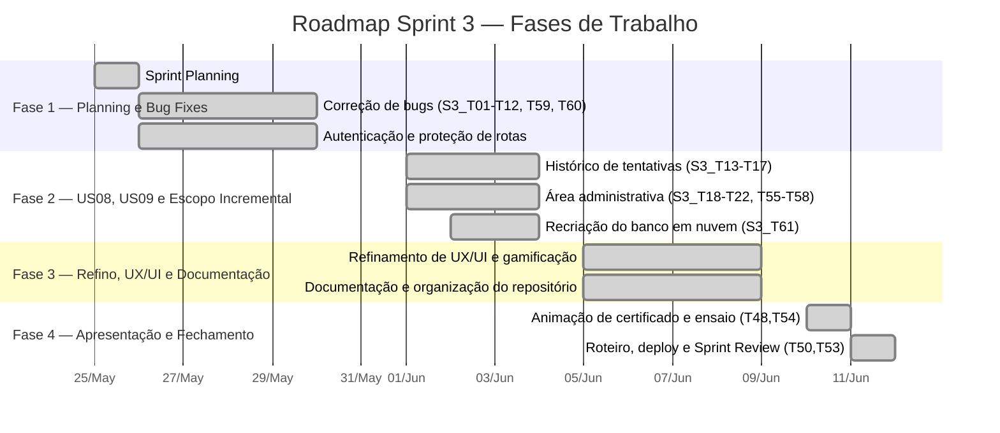

# 📋 Relatório de Contribuição — Sprint 3

← [Índice da Documentação](../../README.md) · [Gestão Ágil — Scrum](../README.md) · [Sprint 3](sprint-3.md) · [Dailies](atas/dailies/)

**Período:** 25/05/2026 — 11/06/2026 (13 dias úteis)  
**Sprint Goal:** Entregar o histórico de tentativas (US08) e a área administrativa (US09), corrigir bugs remanescentes, melhorar a experiência visual e preparar a apresentação final do projeto  
**Resultado:** ✅ 128/128 SP entregues (115 iniciais + 13 de escopo incremental) — Burndown zerado em 11/06  
**Dailies documentadas:** 7 (29/05, 01/06, 02/06, 03/06, 08/06, 09/06, 10/06) — presença total em todas

---

## Visão Geral do Roadmap

---

## Cronologia Diária

| Data | Dia | Foco Principal | Destaques |
|:----:|-----|----------------|-----------|
| 25/05 | Seg | 📋 Sprint Planning | Definição de 61 tasks e 128 SP (115 iniciais); consolidação da documentação de início |
| 26–28/05 | Ter–Qui | 🐛 Correção de bugs | Frente de bug fixes herdados da Sprint 2 (exames, imagens, rotas, navbar, footer) |
| 29/05 | Sex | 🚀 Início das histórias | `historico.repositories.js` (US08); correção de imagens das questões; mensagens motivacionais |
| 01/06 | Seg | 🔧 Escopo +13 SP | Adição de S3_T55–T61 para fechar a área administrativa; CRUD admin no backend; página "Sobre" |
| 02/06 | Ter | 🛠️ Área administrativa | Refatoração do `authAdmin` + integração ao front; rotas pré-login; início da recriação do banco |
| 03/06 | Qua | 📝 Admin e documentação | Integração do cadastro de questões; manual do usuário; organização da pasta `docs`; modelo lógico |
| 04/06 | Qui | 🔴 Feriado | Corpus Christi — sem atividades |
| 05/06 | Sex | 🎨 Refinamento | Ajustes de UX/UI e refinamento do produto |
| 08/06 | Seg | 📚 Documentação e refino | READMEs organizados; refatoração do footer; conclusão de S3_T44, S3_T46 e S3_T59 |
| 09/06 | Ter | 🧩 Ajustes finais | Product Backlog atualizado; refatoração de CSS da sidebar; animação de certificado (S3_T48) |
| 10/06 | Qua | 🎬 Pré-apresentação | Animação de certificado e ensaio concluídos (S3_T48, T53, T54); início do vídeo da review |
| 11/06 | Qui | 🏁 Sprint concluída | Organização do repositório/Git e deploy (S3_T23, T45, T50); **Sprint Review** — 0 SP restantes |

---

## Contribuições por Integrante

### 🎯 Gabriel Travensolli — *Scrum Master*

> **Papel:** Facilitação, correção de rotas, infraestrutura administrativa, documentação técnica e organização do repositório.

| Período | Atividades |
|---------|-----------|
| 25–29/05 | Consolidação da documentação de início da Sprint 3 e criação das tarefas no Projects; alinhamento da página "Sobre" com Lucas e do ajuste do "Conheça o Scrum" com Vinícius |
| 01–03/06 | Ajuste das URLs das páginas "scrum" e "manifesto" pré-login (S3_T09, S3_T10); atualização da documentação da sprint para incluir as novas tarefas (S3_T55–T61); idealização da refatoração da organização da documentação |
| 05–09/06 | Estudo de formatos de apresentação da documentação/repositório; análise dos ajustes de documentação feitos pela Andrea; retorno da documentação ao formato anterior após quebra por conflitos de merge |
| 10–11/06 | Elaboração do fechamento da Sprint 3; reorganização da estrutura do repositório e da documentação Git (S3_T23, S3_T45); preparação da Sprint Review |

**Tarefas formalmente atribuídas:** S3_T02, S3_T09, S3_T10, S3_T12, S3_T20, S3_T23, S3_T29, S3_T41, S3_T42, S3_T43, S3_T45, S3_T46, S3_T53, S3_T56, S3_T57, S3_T58

**Resumo:** Facilitou as 7 dailies documentadas e manteve o burndown atualizado. Responsável pela correção das rotas pré-login, por parte da integração administrativa e pela documentação técnica (UML, BD, README), liderando junto com Vinícius a reorganização do repositório e da documentação Git — pendência recorrente das retrospectivas anteriores.

---

### 📊 Gustavo Koiti — *Product Owner*

> **Papel:** Gestão do backlog, correção de imagens, backend administrativo, recriação do banco em nuvem e vídeo da review.

| Período | Atividades |
|---------|-----------|
| 25–29/05 | Resolução do carregamento de imagens nos exames (S3_T03, S3_T59); priorização do backlog e ataque às tasks de backend |
| 01–03/06 | Adequação de imagens nos questionários; desenvolvimento de ajustes finos; recriação do banco de dados no Neon (S3_T61); finalização da RF12 |
| 08–09/06 | Conclusão da RF12; atualização do Product Backlog (S3_T44); finalização das tasks restantes e início da elaboração da apresentação final |
| 10–11/06 | Revisão dos arquivos do repositório; gravação e renderização do vídeo da final review (Sprint Review) |

**Tarefas formalmente atribuídas:** S3_T01, S3_T03, S3_T14, S3_T18, S3_T19, S3_T22, S3_T43, S3_T44, S3_T50, S3_T53, S3_T59, S3_T60, S3_T61

**Resumo:** Conduziu a priorização do backlog e a revisão do Product Backlog (S3_T44). Corrigiu o carregamento de imagens das questões (ressalva herdada da Sprint 2), recriou o banco de dados em nuvem (S3_T61) e produziu o vídeo da Sprint Review que validou a entrega final.

---

### 🎨 Andrea Turíbio — *Dev*

> **Papel:** Front-end, refinamento de UX/UI, gamificação, manual do aluno e organização da documentação.

| Período | Atividades |
|---------|-----------|
| 25–29/05 | Execução de múltiplas tasks de front-end e UX/UI (botão "Sair", favicon, redundância do nome no dashboard, responsividade) |
| 01–03/06 | Continuidade dos ajustes de front-end; desenvolvimento do manual do usuário (S3_T46); organização da pasta `docs` |
| 05–08/06 | Refino do front-end; resolução de conflitos de PR com a ajuda do Henrique |
| 09–10/06 | Desenvolvimento da animação de geração de certificado (S3_T48); revisões finais e alinhamento com a equipe |

**Tarefas formalmente atribuídas:** S3_T05, S3_T08, S3_T11, S3_T16, S3_T21, S3_T25, S3_T27, S3_T28, S3_T30, S3_T31, S3_T32, S3_T33, S3_T37, S3_T38, S3_T39, S3_T40, S3_T46, S3_T48, S3_T49, S3_T51, S3_T52

**Resumo:** Principal responsável pelo refinamento visual da sprint — favicon, responsividade, certificado para impressão, padronização de navbar/footer e a unificação da terminologia "Módulo". Entregou a animação de geração de certificado (S3_T48), o manual do aluno (S3_T46) e contribuiu na organização da documentação.

---

### 🖌️ Henrique Camargo — *Dev*

> **Papel:** Front-end de histórico/admin, controle de tentativas, refatoração de CSS e organização dos READMEs.

| Período | Atividades |
|---------|-----------|
| 25–29/05 | Revisão dos fluxos de UX/front-end; estudo de melhorias e refinos para a Sprint 3 |
| 01–03/06 | Definição e resolução do comportamento após o fim das tentativas de prova (S3_T12); cancelamento da feature "esqueceu a senha"; início da organização dos READMEs |
| 08–09/06 | Conclusão da organização dos READMEs; correções na área administrativa (cadastro de questões); refatoração dos arquivos CSS, centralizando estilos compartilhados da sidebar |
| 10–11/06 | Conclusão da refatoração de CSS; apoio aos testes finais e revisões para a apresentação do projeto |

**Tarefas formalmente atribuídas:** S3_T04, S3_T06, S3_T07, S3_T15, S3_T16, S3_T17, S3_T21, S3_T28, S3_T30, S3_T34, S3_T35, S3_T36, S3_T37, S3_T38, S3_T40, S3_T47, S3_T48, S3_T51, S3_T52

**Resumo:** Atuou na linha de frente do front-end de histórico e da área administrativa, resolveu o controle de tentativas adicionais (S3_T12) e refatorou o CSS da sidebar para reduzir duplicações. Organizou os READMEs do projeto e apoiou a correção da área administrativa após a recriação do banco.

---

### 🎯 Lucas Amorim — *Dev*

> **Papel:** Gamificação, página "Sobre", animações pós-prova e ajustes visuais.

| Período | Atividades |
|---------|-----------|
| 25–29/05 | Atualização do botão "Sair" do usuário (S3_T27); mensagens motivacionais após a conclusão da prova (S3_T49) |
| 01–02/06 | Animação após a conclusão da prova; criação da página "Sobre" (S3_T29); botão de direcionamento ao próximo módulo; ajuste da posição do "Sobre" em todas as páginas; atualização do Figma |
| 03–08/06 | Atualização do modelo lógico; revisão dos códigos alterados; apoio ao Marcello na correção do footer das páginas |
| 10–11/06 | Pequenos ajustes na parte visual do site; apoio à organização da apresentação |

**Tarefas formalmente atribuídas:** S3_T04, S3_T05, S3_T06, S3_T07, S3_T08, S3_T15, S3_T17, S3_T21, S3_T27, S3_T29, S3_T30, S3_T31, S3_T34, S3_T35, S3_T39, S3_T47, S3_T49, S3_T51

**Resumo:** Contribuiu fortemente na gamificação (mensagens motivacionais e animações pós-prova) e na criação da página "Sobre". Atuou na navegação entre módulos, em ajustes visuais e no apoio à correção do footer e à preparação da apresentação.

---

### ⚙️ Marcello Campbell — *Dev*

> **Papel:** Backend administrativo, integração `authAdmin`, refatoração de páginas e roteiro de apresentação.

| Período | Atividades |
|---------|-----------|
| 25–29/05 | Conclusão das tasks S3_T22 (reset de senha via admin) e S3_T24 (tempo de sessão JWT); análise da S3_T26 (proteção de rotas) |
| 01–03/06 | Exibição da nota para certificado por módulo (S3_T36); refatoração do `authAdmin` e integração com o front, viabilizando validações a partir do login do Admin (S3_T18, S3_T55); início do estudo do roteiro de apresentação |
| 08–09/06 | Refatoração da página `scrum` e do CSS; criação de um arquivo JS dedicado ao footer de todas as páginas; continuidade do roteiro de apresentação |
| 10/06 | Finalização do roteiro de apresentação (S3_T53) |

**Tarefas formalmente atribuídas:** S3_T01, S3_T03, S3_T13, S3_T14, S3_T18, S3_T19, S3_T22, S3_T24, S3_T26, S3_T36, S3_T50, S3_T55

**Resumo:** Principal desenvolvedor do backend administrativo — refatorou o `authAdmin` e o integrou ao front (S3_T18, S3_T55), entregou o reset de senha (S3_T22) e a exibição de nota por módulo (S3_T36). Refatorou o footer em um arquivo JS único e concluiu o roteiro da apresentação final.

---

### 🔧 Vinicius Augusto — *Dev*

> **Papel:** Backend do histórico, CRUD administrativo, integração e correções de banco/autenticação.

| Período | Atividades |
|---------|-----------|
| 25–29/05 | Implementação da estrutura inicial do `historico.repositories.js` (S3_T13), responsável pelas consultas de histórico de tentativas, questões e respostas |
| 01–02/06 | CRUD administrativo de questões e níveis no backend (S3_T19, S3_T20); correção da inicialização do banco (script admin); adição dos campos "Número da Questão" e "Dificuldade"; integração da listagem e cadastro de questões ao backend (S3_T56) |
| 03/06 | Integração do cadastro de questões com o backend; correção da sequência de IDs da tabela de questões após a atualização do banco; início da edição/exclusão (S3_T57) |
| 08–11/06 | Correções na área administrativa após alterações no banco; refatoração de CSS junto ao time; reorganização da documentação do repositório com Gabriel (S3_T45); retoques finais |

**Tarefas formalmente atribuídas:** S3_T02, S3_T09, S3_T10, S3_T12, S3_T13, S3_T19, S3_T20, S3_T23, S3_T24, S3_T26, S3_T41, S3_T42, S3_T45, S3_T55, S3_T56, S3_T57, S3_T58

**Resumo:** Responsável pelo repositório de histórico (S3_T13) que sustenta a US08 e pela maior parte da integração da área administrativa (CRUD de questões e níveis, listagem, cadastro, edição e exclusão). Liderou as correções de banco e autenticação após a recriação em nuvem e apoiou a reorganização da documentação.

---

## Análise das Fases de Trabalho

> Dados extraídos do cruzamento entre o **Burndown Chart** (pontos reais por dia) e as **atas das Dailies** (tasks reportadas como concluídas).

---

### Fase 1 — Planning e Correção de Bugs (25–29/05)

**Burndown:** 102 → 50 SP · **Concluídos:** 52 SP

Início da sprint com a Sprint Planning (61 tasks, 128 SP) e uma forte frente de correção dos bugs herdados da Sprint 2. Em paralelo, iniciaram-se as histórias US08 (histórico) e a base de autenticação.

| Frente | Tasks | Responsáveis |
|--------|-------|--------------|
| Correção de bugs (exames, imagens, rotas, navbar, footer) | S3_T01–S3_T12, S3_T59, S3_T60 | Marcello, Gustavo, Vinicius, Gabriel, Henrique, Lucas, Andrea |
| Autenticação (sessão JWT, "Lembrar de mim", rotas privadas) | S3_T24, S3_T25, S3_T26 | Marcello, Vinicius, Andrea |
| Início do histórico de tentativas (repository) | S3_T13 | Vinicius, Marcello |
| Gamificação inicial e UX | S3_T27, S3_T49 | Lucas, Andrea |

**Quem fez o quê nesta fase (evidências das Dailies):**

- **Gustavo:** Resolveu o carregamento de imagens nos exames.
- **Vinicius:** Implementou a estrutura inicial do `historico.repositories.js`.
- **Marcello:** Concluiu o reset de senha via admin (S3_T22) e o ajuste de sessão JWT (S3_T24).
- **Lucas:** Entregou o botão "Sair" e as mensagens motivacionais pós-prova (S3_T49).
- **Gabriel:** Consolidou a documentação de início e criou as tarefas no Projects.
- **Andrea / Henrique:** Iniciaram a frente de UX/UI e a revisão dos fluxos de front-end.

---

### Fase 2 — US08, US09 e Escopo Incremental (01–03/06)

**Burndown:** 50 → 13 SP · **Concluídos:** 37 SP

A fase mais produtiva da sprint. A equipe atacou a área administrativa (US09) e, ao perceber a necessidade de fechar a integração completa, adicionou **13 SP de escopo** (S3_T55–S3_T61). A recriação do banco em nuvem ocorreu em paralelo.

| Frente | Tasks | Responsáveis |
|--------|-------|--------------|
| CRUD administrativo (backend e integração) | S3_T18, S3_T19, S3_T20, S3_T55, S3_T56 | Marcello, Vinicius, Gustavo, Gabriel |
| Histórico de tentativas (endpoint e tela) | S3_T14, S3_T15, S3_T16, S3_T17 | Marcello, Henrique, Lucas, Andrea |
| Recriação do banco em nuvem (Neon) | S3_T61 | Gustavo |
| Páginas e UX (Sobre, próximo módulo, motivacionais) | S3_T29, S3_T47, S3_T49 | Lucas, Andrea |
| Controle de tentativas e rotas pré-login | S3_T12, S3_T09, S3_T10 | Henrique, Gabriel, Vinicius |

**Quem fez o quê nesta fase (evidências das Dailies):**

- **Vinicius:** Implementou o CRUD administrativo no backend e corrigiu a inicialização do banco e a integração das rotas administrativas.
- **Marcello:** Refatorou o `authAdmin` e o integrou ao front, viabilizando validações pelo login do Admin.
- **Gustavo:** Recriou o banco de dados remoto no Neon e realizou ajustes finos.
- **Henrique:** Resolveu o comportamento após o fim das duas tentativas de prova (S3_T12).
- **Lucas:** Criou a página "Sobre", o botão para o próximo módulo e refinou as animações.
- **Gabriel:** Ajustou as rotas pré-login e atualizou a documentação da sprint com as novas tarefas.
- **Andrea:** Desenvolveu o manual do usuário e organizou a pasta `docs`.

> [!IMPORTANT]
> A **mudança de escopo de +13 SP** (S3_T55–S3_T61) foi necessária para concluir a integração da área administrativa e recriar o banco em nuvem. Embora entregue, evidenciou que parte do trabalho administrativo não havia sido totalmente mapeado na Planning.

---

### Fase 3 — Refino, UX/UI e Documentação (05–09/06)

**Burndown:** 13 → 10 SP · **Concluídos:** 3 SP

Fase de polimento. Pouca queima de SP, mas intenso trabalho de refinamento visual, refatoração de CSS, organização dos READMEs e da documentação. Conclusão de S3_T44, S3_T46 e S3_T59 em 08/06.

| Frente | Tasks | Responsáveis |
|--------|-------|--------------|
| Documentação (Product Backlog, manual, READMEs) | S3_T44, S3_T46, S3_T43 | Gustavo, Andrea, Gabriel, Henrique |
| Refatoração de CSS e footer | S3_T51, S3_T52 | Henrique, Marcello, Lucas |
| Refino de front-end e UX/UI | S3_T30, S3_T34, S3_T40 | Andrea, Henrique, Lucas |
| Correções da área administrativa pós-banco | S3_T57, S3_T58 | Vinicius, Henrique |

**Quem fez o quê nesta fase (evidências das Dailies):**

- **Henrique:** Organizou os READMEs do projeto e refatorou o CSS da sidebar; corrigiu a área administrativa após alterações no banco.
- **Gustavo:** Atualizou o Product Backlog (S3_T44) e finalizou a RF12.
- **Andrea:** Refinou o front-end e resolveu conflitos de PR com a ajuda do Henrique.
- **Marcello:** Refatorou a página `scrum`/CSS e criou um arquivo JS dedicado ao footer.
- **Vinicius:** Continuou as correções da área administrativa e validações.
- **Gabriel:** Estudou formatos de apresentação da documentação e restaurou o formato após quebra por conflitos de merge.

> [!WARNING]
> A concentração de ajustes simultâneos em arquivos compartilhados gerou **conflitos de merge** nos PRs, resolvidos em conjunto (Andrea + Henrique; restauração da documentação por Gabriel).

---

### Fase 4 — Apresentação e Fechamento (10–11/06)

**Burndown:** 10 → 0 SP · **Concluídos:** 10 SP

Reta final. Conclusão da animação de certificado, do roteiro e do ensaio de apresentação (10/06), e das últimas tarefas de infraestrutura e organização (11/06), zerando a sprint no dia da Review.

| Frente | Tasks | Responsáveis |
|--------|-------|--------------|
| Animação de certificado | S3_T48 | Andrea, Henrique |
| Roteiro e ensaio da apresentação | S3_T53, S3_T54 | Marcello, Gustavo, Gabriel, Time completo |
| Organização do repositório e documentação Git | S3_T23, S3_T45 | Gabriel, Vinicius |
| Atualização do deploy no Render | S3_T50 | Marcello, Gustavo |

**Quem fez o quê nesta fase (evidências das Dailies):**

- **Andrea:** Concluiu a animação de geração de certificado (S3_T48).
- **Marcello:** Finalizou o roteiro de apresentação (S3_T53).
- **Gustavo:** Revisou os arquivos do repositório e produziu o vídeo da final review.
- **Gabriel + Vinicius:** Reorganizaram a estrutura do repositório e a documentação Git (S3_T23, S3_T45).
- **Time completo:** Realizou o ensaio técnico da apresentação (S3_T54).

---

### Resumo Comparativo das Fases

| Fase | Período | Dias Úteis | SP Entregues | SP/Dia |
|------|---------|:----------:|:------------:|:------:|
| 1 — Planning e Bug Fixes | 25–29/05 | 5 | 52 | 10,4 |
| 2 — US08, US09 e Escopo | 01–03/06 | 3 | 37 | 12,3 |
| 3 — Refino e Documentação | 05–09/06 | 3 | 3 | 1,0 |
| 4 — Apresentação e Fechamento | 10–11/06 | 2 | 10 | 5,0 |
| **Total** | **25/05–11/06** | **13** | **128** | **9,8** |

> O burndown manteve-se adiantado em relação à linha ideal durante toda a sprint. A Fase 2 concentrou o pico de produtividade (12,3 SP/dia) com a área administrativa, enquanto a Fase 3, de baixa queima de SP, foi dedicada ao polimento e à documentação.

---

## Métricas de Participação nas Dailies

| Membro | Presença | Taxa |
|--------|:--------:|:----:|
| Gabriel Travensolli | 7/7 | 100% |
| Gustavo Koiti | 7/7 | 100% |
| Andrea Turíbio | 7/7 | 100% |
| Henrique Camargo | 7/7 | 100% |
| Lucas Amorim | 7/7 | 100% |
| Marcello Campbell | 7/7 | 100% |
| Vinicius Augusto | 7/7 | 100% |

> *Consideradas as 7 dailies documentadas (29/05, 01/06, 02/06, 03/06, 08/06, 09/06, 10/06). A daily de 25/05 não ocorreu (Sprint Planning) e 04/06 foi feriado (Corpus Christi). Presença total em todas as dailies registradas.*

---

## Observações Finais

> [!TIP]
> A sprint foi concluída com **100% dos story points entregues** (128/128), incluindo os 13 SP de escopo incremental (área administrativa completa e recriação do banco em nuvem). Encerra o ciclo de três sprints e o MVP completo do ScrumFlow.

> [!IMPORTANT]
> As ações da retrospectiva da Sprint 2 deram resultado: a **distribuição de commits** ficou mais equilibrada, a **task dedicada à apresentação** (S3_T53, S3_T54) garantiu uma entrega final preparada, e a **organização do repositório/documentação Git** (S3_T23, S3_T45) — pendência recorrente — foi finalmente concluída.

> [!WARNING]
> **Pontos de atenção:** conflitos de merge na reta final, decorrentes de ajustes simultâneos em arquivos compartilhados, e a mudança de escopo no meio da sprint para a área administrativa. Aprendizado registrado para projetos futuros: branches mais curtas, PRs menores e mapeamento antecipado de dependências de infraestrutura.

- **Entregas extras (escopo incremental):** S3_T55–S3_T61 (+13 SP) — integração completa da área administrativa e recriação do banco em nuvem.
- **Ressalvas da Sprint 2 corrigidas:** responsividade no redimensionamento da janela e renderização das imagens das questões.
- **Feriado:** 04/06 (Corpus Christi) — sem impacto no resultado final.
- **Validação:** todas as histórias aceitas pelo PO na [Sprint Review](atas/sprint-review.md) de 11/06. Incremento funcional disponível em [scrum-flow-abp.onrender.com](https://scrum-flow-abp.onrender.com/). Vídeo da demonstração: [YouTube](https://youtu.be/pa0tak9AOZI).

---

  <a href="../../README.md">← Voltar ao Índice</a> · <a href="../README.md">Gestão Ágil — Scrum</a> · <a href="sprint-3.md">Sprint 3</a>

