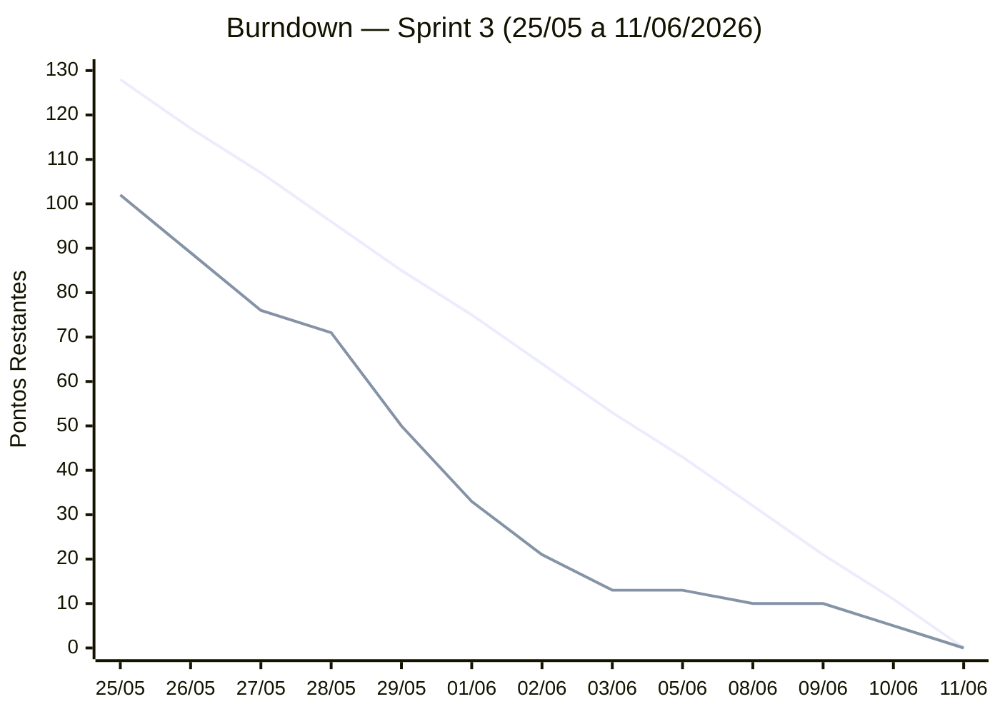

← [Índice da Documentação](../../README.md) · [Gestão Ágil — Scrum](../README.md)

# Sprint 3

**Período:** 25/05/2026 — 11/06/2026
**Sprint Goal:** _Entregar o histórico de tentativas (US08) e a área administrativa (US09), corrigir bugs remanescentes, melhorar a experiência visual e preparar a apresentação final do projeto._
**Histórias:** US08, US09
**Total de pontos comprometidos:** 128 SP (61 tasks)
**Scrum Master:** Gabriel Travensolli
**Product Owner:** Gustavo Koiti

---

## Sprint Backlog

| # | Tarefa | Grupo | Responsável | SP | Status |
|:-:|--------|:-----:|-------------|:--:|:------:|
| S3_T01 | Recriação automática de exame inicial | Bug Fix | Marcello + Gustavo | 3 | ✅ |
| S3_T02 | Integridade após reset de usuário | Bug Fix | Vinicius + Gabriel | 2 | ✅ |
| S3_T03 | Corrigir carregamento de imagens das questões | Bug Fix | Marcello + Gustavo | 3 | ✅ |
| S3_T04 | Corrigir mensagens de validação no cadastro | Bug Fix | Henrique + Lucas | 2 | ✅ |
| S3_T05 | Corrigir animação inicial (2ª linha) | Bug Fix | Andrea + Lucas | 2 | ✅ |
| S3_T06 | Corrigir exibição da escrita/texto na prova | Bug Fix | Henrique + Lucas | 1 | ✅ |
| S3_T07 | Corrigir navbar inconsistente após login | Bug Fix | Henrique + Lucas | 3 | ✅ |
| S3_T08 | Corrigir links do footer | Bug Fix | Andrea + Lucas | 1 | ✅ |
| S3_T09 | Corrigir rota manifesto pré-login | Bug Fix | Vinicius + Gabriel | 2 | ✅ |
| S3_T10 | Corrigir rota scrum pré-login | Bug Fix | Vinicius + Gabriel | 2 | ✅ |
| S3_T11 | Corrigir animação invertida hover footer | Bug Fix | Andrea | 1 | ✅ |
| S3_T12 | Verificar/corrigir comportamento após fim das tentativas | Bug Fix | Vinicius + Gabriel | 2 | ✅ |
| S3_T13 | Repository: historico.repositories.js | US08 | Marcello + Vinicius | 2 | ✅ |
| S3_T14 | Endpoint GET /api/historico/:idUsuario | US08 | Marcello + Gustavo | 3 | ✅ |
| S3_T15 | Página historico.html + historico.js | US08 | Henrique + Lucas | 3 | ✅ |
| S3_T16 | CSS: pages/historico.css | US08 | Andrea + Henrique | 2 | ✅ |
| S3_T17 | Exibir questões erradas na tela de resultado | US08 | Henrique + Lucas | 3 | ✅ |
| S3_T18 | Auth admin — middleware de perfil | US09 | Marcello + Gustavo | 3 | ✅ |
| S3_T19 | CRUD de questões e alternativas (backend) | US09 | Marcello + Vinicius + Gustavo | 5 | ✅ |
| S3_T20 | CRUD de módulos (backend) | US09 | Vinicius + Gabriel | 3 | ✅ |
| S3_T21 | Interface administrativa (frontend) | US09 | Andrea + Henrique + Lucas | 5 | ✅ |
| S3_T22 | Reset de senha via admin | US09 | Marcello + Gustavo | 3 | ✅ |
| S3_T23 | Reorganizar estrutura do repositório | Infra | Gabriel + Vinicius | 2 | ✅ |
| S3_T24 | Aumentar tempo de sessão JWT | Auth | Marcello + Vinicius | 2 | ✅ |
| S3_T25 | Excluir checkbox "Lembrar de mim" | Auth | Andrea | 1 | ✅ |
| S3_T26 | Proteger rotas privadas | Auth | Vinicius + Marcello | 3 | ✅ |
| S3_T27 | Ajustar botão 'Sair' na navbar | UX/UI | Andrea + Lucas | 1 | ✅ |
| S3_T28 | Adicionar favicon do ScrumFlow | UX/UI | Andrea + Henrique | 1 | ✅ |
| S3_T29 | Criar página 'Sobre' | UX/UI | Lucas + Gabriel | 2 | ✅ |
| S3_T30 | Melhorar responsividade geral | UX/UI | Andrea + Henrique + Lucas | 3 | ✅ |
| S3_T31 | Refatorar página 'O que é Scrum' | UX/UI | Andrea + Lucas | 2 | ✅ |
| S3_T32 | Corrigir redundância do nome no Dashboard | UX/UI | Andrea | 1 | ✅ |
| S3_T33 | Melhorar frase contraste Dashboard | UX/UI | Andrea | 1 | ✅ |
| S3_T34 | Melhorar layout da seção de provas | UX/UI | Henrique + Lucas | 3 | ✅ |
| S3_T35 | Alterar mensagem pós-prova | UX/UI | Lucas + Henrique | 2 | ✅ |
| S3_T36 | Exibir nota para certificado por módulo | UX/UI | Marcello + Henrique | 2 | ✅ |
| S3_T37 | Trocar "Nível" por "Módulo" na UI | UX/UI | Andrea + Henrique | 3 | ✅ |
| S3_T38 | Certificado branco para impressão | UX/UI | Andrea + Henrique | 2 | ✅ |
| S3_T39 | Centralizar links na navbar | UX/UI | Andrea + Lucas | 1 | ✅ |
| S3_T40 | Melhorar nome do usuário na navbar | UX/UI | Andrea + Henrique | 2 | ✅ |
| S3_T41 | Atualizar diagramas UML | Doc | Marcello + Vinicius + Gabriel | 3 | ✅ |
| S3_T42 | Atualizar modelos BD | Doc | Gabriel + Vinicius | 2 | ✅ |
| S3_T43 | Atualizar README.md | Doc | Gabriel + Gustavo | 1 | ✅ |
| S3_T44 | Atualizar Product Backlog | Doc | Gustavo | 1 | ✅ |
| S3_T45 | Melhorar organização da documentação Git | Doc | Gabriel + Vinicius | 2 | ✅ |
| S3_T46 | Criar manual de uso do aluno | Doc | Gabriel + Andrea | 2 | ✅ |
| S3_T47 | Animação de conclusão de módulo | Gamif. | Henrique + Lucas | 2 | ✅ |
| S3_T48 | Animação de geração de certificado | Gamif. | Andrea + Henrique | 2 | ✅ |
| S3_T49 | Mensagens motivacionais | Gamif. | Andrea + Lucas | 1 | ✅ |
| S3_T50 | Atualizar deploy no Render | Infra | Marcello + Gustavo | 1 | ✅ |
| S3_T51 | Padronizar navbar em todas as páginas | Refactor | Andrea + Henrique + Lucas | 3 | ✅ |
| S3_T52 | Incluir footer em todas as páginas | Refactor | Andrea + Henrique | 2 | ✅ |
| S3_T53 | Criar roteiro da apresentação final | Apresentação | Gustavo + Gabriel | 2 | ✅ |
| S3_T54 | Realizar ensaio técnico | Apresentação | Time completo | 1 | ✅ |
| S3_T55 | Exibir acesso administrativo após login de usuário admin | US09 | Vinicius + Marcello | 2 | ✅ |
| S3_T56 | Integrar área administrativa aos endpoints de questões e níveis | US09 | Vinicius + Gabriel | 3 | ✅ |
| S3_T57 | Integrar edição e exclusão de questões e níveis na área administrativa | US09 | Vinicius + Gabriel | 2 | ✅ |
| S3_T58 | Adequar formulário administrativo ao modelo de questões do backend | US09 | Vinicius + Gabriel | 1 | ✅ |
| S3_T59 | Corrigir carregamento de imagens no questionário | Bug Fix | Gustavo | 1 | ✅ |
| S3_T60 | Corrigir página Scrum | Bug Fix | Gustavo | 1 | ✅ |
| S3_T61 | Recriar banco de dados em nuvem | Infra | Gustavo | 3 | ✅ |

**Incremento esperado ao final da Sprint:**

- Usuário consegue consultar o histórico detalhado de suas tentativas por módulo
- Detalhes de cada tentativa: questões sorteadas, resposta escolhida vs. correta
- Administrador consegue gerenciar questões, alternativas e módulos via interface web
- Administrador pode resetar a senha de qualquer usuário
- Bugs de exames, validação, rotas e navbar corrigidos
- Melhorias visuais: favicon, responsividade, página "Sobre", certificado para impressão
- Terminologia "Nível" trocada por "Módulo" em toda a interface
- Animações de gamificação (conclusão de módulo, certificado, mensagens motivacionais)
- Navbar e footer padronizados em todas as páginas
- Documentação UML, BD, README e manual do aluno atualizados
- Deploy validado no Render

---

## Burndown Chart

> Atualizado diariamente pelo Scrum Master ao final de cada Daily.

**Como atualizar o gráfico:**
1. Edite a segunda linha `line [...]` do bloco Mermaid abaixo substituindo cada valor pelo total de pontos **restantes** naquele dia
2. Preencha a mesma informação na coluna **Pontos Real** da tabela de acompanhamento
3. Ajuste o intervalo do `y-axis` conforme necessário

> 🔵 **Linha 1 — Ideal:** queima linear esperada (~10.67 SP/dia — não editar)
> 🟠 **Linha 2 — Real:** substituir os `51` pelos pontos efetivamente restantes a cada dia

| Dia | Data | Dia da semana | Pontos Ideal | Pontos Real | Impedimentos |
|:---:|:----:|:-------------:|:------------:|:-----------:|:-------------|
| 1  | 25/05 | Segunda | 128 | 102 | — |
| 2  | 26/05 | Terça   | 117 | 89  | — |
| 3  | 27/05 | Quarta  | 107 | 76  | — |
| 4  | 28/05 | Quinta  | 96  | 71  | — |
| 5  | 29/05 | Sexta   | 85  | 50  | — |
| 6  | 01/06 | Segunda | 75  | 33 | Scope +13 SP (S3_T55–S3_T61); S3_T55 entregue |
| 7  | 02/06 | Terça   | 64  | 21 | — |
| 8  | 03/06 | Quarta  | 53  | 13 | — |
| —  | 04/06 | *Quinta — Corpus Christi* | — | — | 🔴 Feriado |
| 9  | 05/06 | Sexta   | 43  | 13 | — |
| 10 | 08/06 | Segunda | 32  | 10 | — |
| 11 | 09/06 | Terça   | 21  | 10 | — |
| 12 | 10/06 | Quarta  | 11  | 5  | — |
| 13 | 11/06 | Quinta  | 0   | 0  | — |

---

## Cerimônias

| Cerimônia | Ata |
|-----------|-----|
| Sprint Planning | [atas/sprint-planning.md](atas/sprint-planning.md) |
| Sprint Review | [atas/sprint-review.md](atas/sprint-review.md) |
| Sprint Retrospective | [atas/sprint-retrospectiva.md](atas/sprint-retrospectiva.md) |
| Dailies | [atas/dailies/](atas/dailies/) |

> As atas são criadas a partir dos templates em [`templates/`](../templates/).

---

## DoR e DoD

Checklists de entrada (DoR) e conclusão (DoD) das histórias desta sprint:

[dor-dod.md](dor-dod.md)

---

## Documentos Complementares

| Documento | Descrição |
|---|---|
| [relatorio-contribuicao-3.md](relatorio-contribuicao-3.md) | Participação da equipe por integrante e frentes de trabalho |

---

## Resultado da Sprint

Validado na [Sprint Review](atas/sprint-review.md) de 11/06/2026.

**Pontos planejados:** 128 (115 iniciais + 13 de escopo incremental em 01/06)
**Pontos entregues (DoD completo):** 128
**Pontos restantes:** 0
**Velocidade da sprint:** 128 pontos — Aproveitamento de 100%

**Histórias concluídas:** US08 (Histórico de tentativas) e US09 (Área administrativa), além de 13 correções de bugs, melhorias de UX/UI, gamificação, atualização de documentação e preparação da apresentação final.
**Histórias não entregues (e motivo):** nenhuma.

### Observações sobre a execução

- Burndown encerrado em **0 SP no dia 11/06** (aproveitamento de 100%), adiantado em relação à linha ideal durante toda a sprint; as últimas tarefas (fechamento, organização do repositório/documentação e apresentação) foram concluídas entre 08/06 e 11/06.
- **Mudança de escopo:** +13 SP (S3_T55–S3_T61) adicionados em 01/06 para concluir a integração da área administrativa e recriar o banco em nuvem.
- Terminologia **"Nível" → "Módulo"** unificada na interface (S3_T37).
- Sprint final do projeto: encerra a entrega do MVP completo do ScrumFlow.

---

  <a href="../../README.md">← Voltar ao Índice</a> · <a href="../README.md">Gestão Ágil — Scrum</a>

