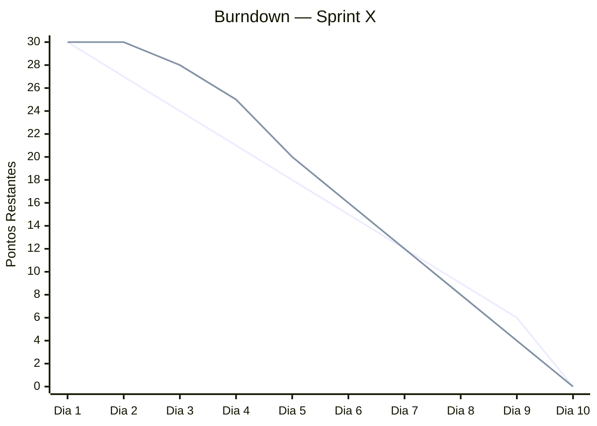

# Burndown Chart — Sprint X

**Sprint:** Sprint X  
**Período:** DD/MM — DD/MM/2026  
**Total de pontos comprometidos:** —  
**Scrum Master:** Gabriel Travensolli

---

## Gráfico de Burndown

> Atualizado diariamente pelo Scrum Master ao final de cada Daily.  
> A linha **ideal** representa a queima linear dos pontos ao longo dos dias úteis.  
> A linha **real** representa os pontos efetivamente restantes a cada dia.

> 🔵 Linha 1 = Ideal (burndown esperado)  
> 🟠 Linha 2 = Real (burndown efetivo) — atualizar diariamente

---

## Tabela de Acompanhamento Diário

| Dia | Data | Pontos Restantes (Ideal) | Pontos Restantes (Real) | Impedimentos do dia |
|-----|------|:------------------------:|:-----------------------:|---------------------|
| 1 | DD/MM | — | — | — |
| 2 | DD/MM | — | — | — |
| 3 | DD/MM | — | — | — |
| 4 | DD/MM | — | — | — |
| 5 | DD/MM | — | — | — |
| 6 | DD/MM | — | — | — |
| 7 | DD/MM | — | — | — |
| 8 | DD/MM | — | — | — |
| 9 | DD/MM | — | — | — |
| 10 | DD/MM | — | — | — |

---

## Análise ao Final da Sprint

**Pontos planejados:** —  
**Pontos entregues (conforme DoD):** —  
**Pontos não entregues:** —  
**Velocidade da sprint:** — pontos

### Observações sobre o burndown

> Registre se houve aceleração, desaceleração, bloqueios ou escopo adicionado/removido durante a sprint.

_A preencher na Sprint Review / Retrospectiva._
