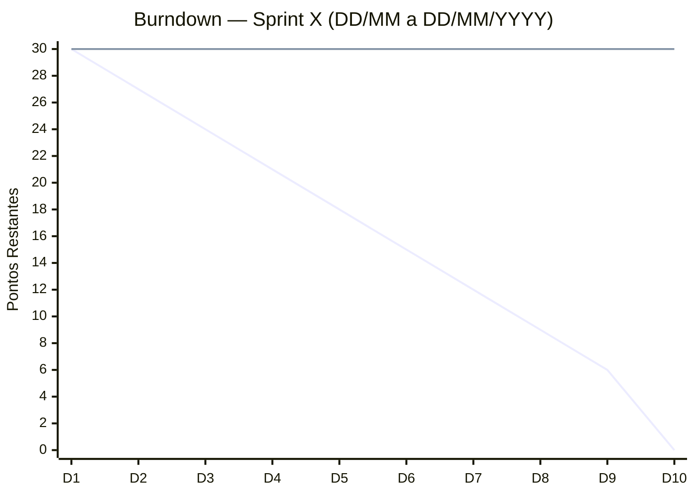

<!-- Template — copie para seu destino e ajuste o caminho do Índice -->
← [Índice da Documentação](../../README.md)

# Sprint X

> **Como usar:** copie este arquivo para `docs/scrum/sprint-N/sprint-N.md` e substitua todos os campos marcados com `X` ou `—`.
> O burndown deve ser atualizado pelo Scrum Master ao final de cada Daily — edite a tabela e ajuste os valores da linha `Real` no bloco Mermaid.

**Período:** DD/MM/YYYY — DD/MM/YYYY  
**Sprint Goal:** _Descreva em uma frase o que o time se compromete a entregar e qual valor isso gera._  
**Histórias:** US0X, US0X  
**Total de pontos comprometidos:** —  
**Scrum Master:** Gabriel Travensolli  
**Product Owner:** Gustavo Koiti  

---

## Sprint Backlog

| Tarefa | Responsável | Status |
|--------|-------------|:------:|
| Tarefa 1 — descrição técnica (US0X) | A definir | 🔲 |
| Tarefa 2 — descrição técnica (US0X) | A definir | 🔲 |

**Incremento esperado ao final da Sprint:**

- _Descreva o que o usuário conseguirá fazer_
- _Descreva o que estará persistido/funcionando no sistema_

---

## Burndown Chart

> Atualizado diariamente pelo Scrum Master ao final de cada Daily.

**Como atualizar o gráfico:**
1. Edite a segunda linha `line [...]` do bloco Mermaid abaixo substituindo cada valor pelo total de pontos **restantes** naquele dia
2. Preencha a mesma informação na coluna **Pontos Real** da tabela de acompanhamento
3. Remova do eixo `x-axis` os dias que forem feriados ou fins de semana
4. Ajuste o intervalo do `y-axis` conforme o total de pontos comprometidos da sprint

> 🔵 **Linha 1 — Ideal:** queima linear esperada (não editar)  
> 🟠 **Linha 2 — Real:** substituir os `30` pelos pontos efetivamente restantes a cada dia

| Dia | Data | Dia da semana | Pontos Ideal | Pontos Real | Impedimentos |
|:---:|:----:|:-------------:|:------------:|:-----------:|--------------|
| 1 | DD/MM | — | — | — | — |
| 2 | DD/MM | — | — | — | — |
| 3 | DD/MM | — | — | — | — |
| 4 | DD/MM | — | — | — | — |
| 5 | DD/MM | — | — | — | — |
| 6 | DD/MM | — | — | — | — |
| 7 | DD/MM | — | — | — | — |
| 8 | DD/MM | — | — | — | — |
| 9 | DD/MM | — | — | — | — |
| 10 | DD/MM | — | — | — | — |

---

## Cerimônias

| Cerimônia | Ata |
|-----------|-----|
| Sprint Planning | [atas/sprint-planning.md](atas/sprint-planning.md) |
| Sprint Review | [atas/sprint-review.md](atas/sprint-review.md) |
| Sprint Retrospective | [atas/sprint-retrospectiva.md](atas/sprint-retrospectiva.md) |
| Dailies | [atas/dailies/](atas/dailies/) |

> As atas são criadas a partir dos templates em [`templates/`](../templates/).

---

## DoR e DoD

Checklists de entrada (DoR) e conclusão (DoD) das histórias desta sprint:

---

## Resultado da Sprint

> A preencher ao final da Sprint Review.

**Pontos planejados:** —  
**Pontos entregues (DoD completo):** —  
**Pontos não entregues:** —  
**Velocidade da sprint:** — pontos  

**Histórias concluídas:** —  
**Histórias não entregues (e motivo):** —  

### Observações sobre a execução

> Registre desvios do burndown, bloqueios recorrentes, mudança de escopo ou qualquer fato relevante para a retrospectiva.

_A preencher na Sprint Review / Retrospectiva._

