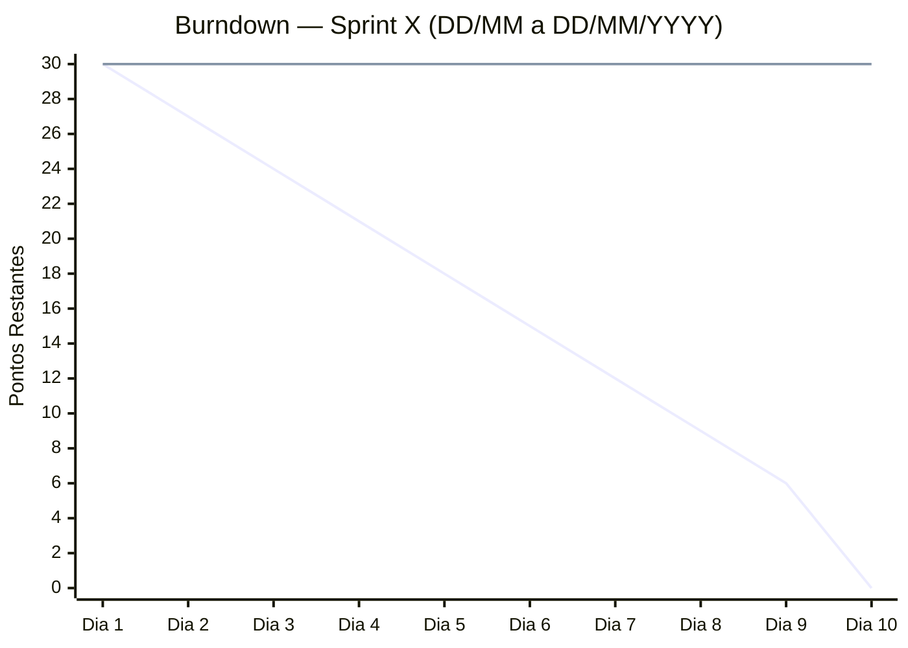

# Sprint X

> **Como usar:** copie este arquivo para `sprint-N/sprint-N.md`, substitua todos os campos marcados com `X` ou `[ ]` e preencha o burndown conforme os dias úteis reais da sprint.

**Período:** DD/MM/YYYY — DD/MM/YYYY  
**Sprint Goal:** _Descreva em uma frase o que o time se compromete a entregar e qual valor isso gera._  
**Histórias:** US0X, US0X  
**Scrum Master:** Gabriel Travensolli  
**Product Owner:** Gustavo Koiti  

---

## Sprint Backlog

| Tarefa | Responsável | Status |
|--------|-------------|--------|
| Tarefa 1 — descrição técnica (US0X) | A definir | 🔲 |
| Tarefa 2 — descrição técnica (US0X) | A definir | 🔲 |

### Entrega / Incremento esperado

- _Descreva o que o usuário conseguirá fazer ao final desta sprint_
- _Descreva o que estará persistido/funcionando no sistema_

---

## Burndown Chart

> Atualizado diariamente pelo Scrum Master ao final de cada Daily.  
> A linha **ideal** representa queima linear dos pontos nos dias úteis.  
> A linha **real** representa os pontos efetivamente restantes a cada dia.

> ⚠️ Remova do eixo feriados e fins de semana. Ajuste as linhas conforme os pontos comprometidos.  
> 🔵 Linha 1 = Ideal | 🟠 Linha 2 = Real — substituir os `30` pelos pontos reais dia a dia.

| Dia | Data | Dia da semana | Pontos Ideal | Pontos Real | Impedimentos |
|:---:|------|:-------------:|:------------:|:-----------:|--------------|
| 1 | DD/MM | — | — | — | — |
| 2 | DD/MM | — | — | — | — |
| 3 | DD/MM | — | — | — | — |
| 4 | DD/MM | — | — | — | — |
| 5 | DD/MM | — | — | — | — |
| 6 | DD/MM | — | — | — | — |
| 7 | DD/MM | — | — | — | — |
| 8 | DD/MM | — | — | — | — |
| 9 | DD/MM | — | — | — | — |
| 10 | DD/MM | — | — | — | — |

**Velocidade da sprint:** — pontos entregues

---

## Cerimônias

| Cerimônia | Ata |
|-----------|-----|
| Sprint Planning | [atas/sprint-planning.md](atas/sprint-planning.md) |
| Sprint Review | [atas/sprint-review.md](atas/sprint-review.md) |
| Sprint Retrospective | [atas/sprint-retrospectiva.md](atas/sprint-retrospectiva.md) |
| Dailies | [atas/dailies/](atas/dailies/) |

> As atas são criadas a partir de [`templates/`](../templates/) no início de cada sprint.

---

## DoR e DoD

Checklists de entrada (DoR) e conclusão (DoD) das histórias desta sprint:

✅ [dor-dod.md](dor-dod.md)

---

## Resultado da Sprint

> A preencher ao final da Sprint Review.

**Incremento entregue:** —  
**Histórias concluídas (DoD completo):** —  
**Histórias não entregues:** —  
**Observações:** —
